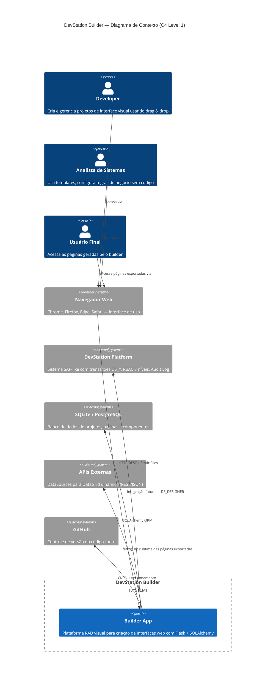
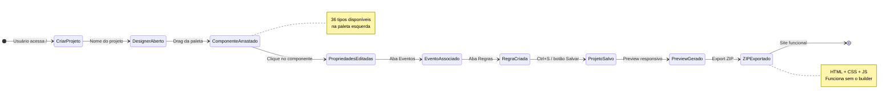

# 01 · Visão Geral do Produto

> 📍 [Início](./README.md) › Visão Geral

---

## 🎯 Propósito

**DevStation Builder** é uma plataforma RAD *(Rapid Application Development)* visual, inspirada no modelo **Delphi / Visual Studio WinForms**, que permite construir interfaces web empresariais através de **drag & drop** sem escrever HTML/CSS/JS.

O sistema gera código limpo, exportável como ZIP, e está projetado para integração futura com a **DevStation Platform** (sistema SAP-like com transações `DS_*`).

---

## 👥 Personas

| Persona | Perfil DS_ | Necessidade Principal |
|---------|-----------|----------------------|
| **Analista de Sistemas** | `BANALYST` | Prototipar telas rapidamente usando templates, configurar regras de negócio sem código |
| **Developer** | `DEVELOPER` | Construir UIs completas, exportar código para integrar em projetos, criar transações `NDS_*` |
| **Core Developer** | `CORE_DEV` | Criar novos tipos de componentes, customizar o sistema, integrar APIs externas |
| **Power User** | `PUSER` | Usar interfaces geradas, preencher formulários, visualizar dashboards |

---

## 💡 Diferenciais Estratégicos

| Característica | Benefício |
|----------------|-----------|
| Drag & drop com snap | Posicionamento preciso sem escrever CSS |
| 36 componentes prontos | Cobre 95% dos casos de uso empresariais |
| Sistema de eventos visual | Associar ações sem JavaScript manual |
| Sistema de regras | Validação, visibilidade, cálculo automático |
| Export limpo | HTML/CSS/JS independente, sem dependência do builder |
| Templates prontos | Login, Dashboard KPI, CRM, Landing Page, Relatório |
| Multi-páginas | Projetos completos com múltiplas telas |
| Vendors locais | Funciona offline com Bootstrap, BI icons locais |

---

## 🗺️ C4 — Contexto do Sistema

---

## 📦 Escopo do Sistema

### Dentro do Escopo (v2.2)
- ✅ Editor visual drag & drop com canvas absoluto
- ✅ 36 componentes (entrada, visualização, container, dados, feedback, navegação, tempo)
- ✅ Sistema de eventos com editor visual
- ✅ Sistema de regras (validação, visibilidade, cálculo)
- ✅ Multi-seleção, rubber-band, alinhamento em grupo
- ✅ Layers Panel com drag de z-index, lock, visibilidade
- ✅ Multi-páginas + duplicar página
- ✅ Galeria de 5 templates prontos
- ✅ Upload de imagens
- ✅ Preview responsivo (desktop/tablet/mobile)
- ✅ Export ZIP (HTML + CSS + JS funcional)

### Fora do Escopo (próximas sprints)
- ⏳ Autenticação de usuários
- ⏳ Colaboração em tempo real
- ⏳ Deploy em produção com PostgreSQL
- ⏳ Integração formal DS_DESIGNER
- ⏳ Componentes TinyMCE e ApexCharts

---

## 🔄 Fluxo Principal de Valor

---

## 🔗 Navegação

| Anterior | Próximo |
|----------|---------|
| [← Índice](./README.md) | [Arquitetura →](./02_arquitetura.md) |
