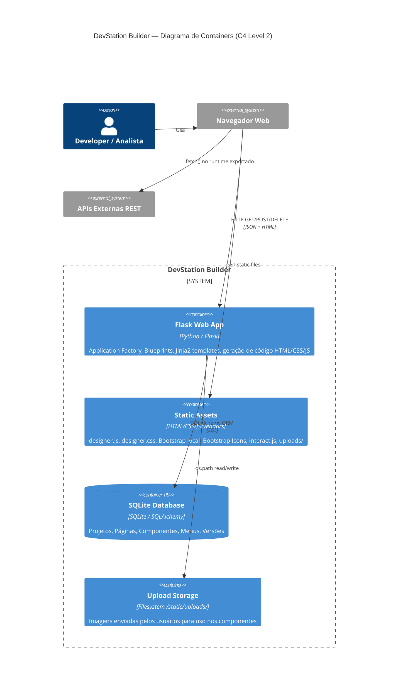
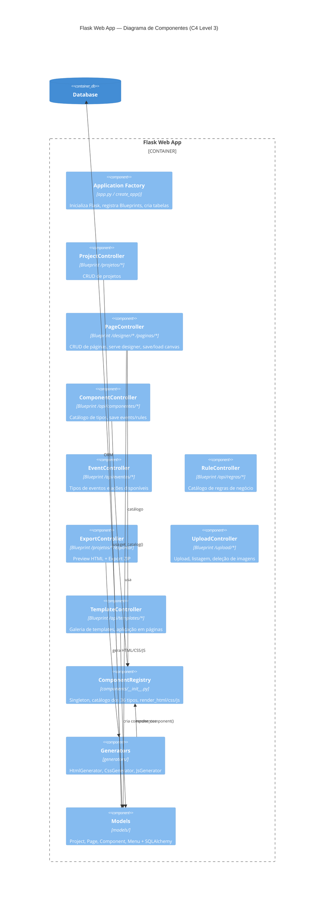
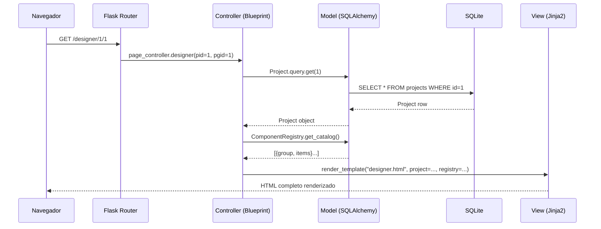

# 02 · Arquitetura do Sistema

> 📍 [Início](./README.md) › Arquitetura

---

## 🏗️ Stack Técnica

| Camada | Tecnologia | Versão | Finalidade |
|--------|-----------|--------|-----------|
| **Backend** | Flask | 3.x | Framework web, roteamento, Application Factory |
| **ORM** | SQLAlchemy + Flask-SQLAlchemy | 3.x | Persistência, relacionamentos, migrations |
| **Banco** | SQLite (dev) / PostgreSQL (prod) | — | Armazenamento de projetos e componentes |
| **Templates** | Jinja2 | 3.x | Renderização server-side das views |
| **Frontend** | JavaScript Puro (ES6+) | — | Toda lógica de designer sem frameworks pesados |
| **UI Framework** | Bootstrap 5 (local) | 5.3.3 | Layout responsivo e componentes Bootstrap |
| **Ícones** | Bootstrap Icons (local) | 1.11.3 | Ícones SVG via classes CSS |
| **Drag & Drop** | interact.js | 1.10.27 | Drag, resize e snap no canvas |
| **Gráficos (export)** | Chart.js | 4.4 | Gráficos no HTML exportado |

---

## 📐 C4 — Containers (Nível 2)



---

## 🧩 C4 — Componentes da Web App (Nível 3)



---

## 📁 Estrutura de Diretórios

```
dsb_v2/
│
├── app.py                     ← Application Factory (create_app)
├── config.py                  ← Configurações centralizadas por ambiente
├── requirements.txt
│
├── models/                    ── MODEL LAYER ──────────────────────────────
│   ├── __init__.py            ← db = SQLAlchemy() + exports
│   ├── project.py             ← Project (id, name, canvas_w/h/bg, pages, menus)
│   ├── page.py                ← Page (multi-página, canvas override)
│   ├── component.py           ← Component (type, pos, properties/events/rules JSON)
│   ├── menu.py                ← Menu (main + sidebar como JSON configurável)
│   └── menu_defaults.py       ← Configurações JSON padrão dos menus
│
├── controllers/               ── CONTROLLER LAYER ─────────────────────────
│   ├── __init__.py            ← register_blueprints()
│   ├── project_controller.py  ← CRUD /projetos/*
│   ├── page_controller.py     ← Designer + CRUD páginas + save/load + dup
│   ├── component_controller.py← Catálogo + eventos/regras por componente
│   ├── event_controller.py    ← /api/eventos/tipos + /api/eventos/acoes
│   ├── rule_controller.py     ← /api/regras/tipos
│   ├── export_controller.py   ← Preview HTML + Export ZIP
│   ├── menu_controller.py     ← /api/projetos/*/menus
│   ├── upload_controller.py   ← /upload/imagem (POST/GET/DELETE)
│   └── template_controller.py ← /api/templates (catálogo + aplicar)
│
├── views/                     ── VIEW LAYER ───────────────────────────────
│   ├── base.html              ← Layout NiceAdmin autossuficiente
│   ├── dashboard.html         ← Grid de projetos
│   └── designer.html          ← IDE visual completo
│
├── components/                ── COMPONENT REGISTRY ──────────────────────
│   ├── __init__.py            ← ComponentRegistry singleton
│   ├── base_component.py      ← BaseComponent (ABC)
│   └── definitions.py         ← 36 componentes implementados
│
├── events/                    ── EVENT SYSTEM ────────────────────────────
│   ├── __init__.py
│   ├── event_types.py         ← 11 categorias, ~50 tipos (onClick, onTick...)
│   └── event_actions.py       ← 23 ações pré-definidas (navegar, toast, API...)
│
├── rules/                     ── RULES SYSTEM ────────────────────────────
│   ├── __init__.py
│   └── rule_types.py          ← 18 tipos (validação, visibilidade, cálculo)
│
├── generators/                ── CODE GENERATION ─────────────────────────
│   ├── __init__.py
│   ├── html_generator.py      ← HTML completo + DSB runtime JS
│   ├── css_generator.py       ← CSS consolidado para export
│   └── js_generator.py        ← JS de eventos e regras para export
│
└── static/
    ├── css/designer.css        ← IDE dark theme CSS (504 linhas)
    ├── js/designer.js          ← Engine frontend (2.479 linhas, 14 módulos)
    ├── uploads/               ← Imagens enviadas pelos usuários
    └── assets/
        ├── css/style.css       ← NiceAdmin CSS
        ├── js/main.js          ← NiceAdmin JS
        └── vendor/            ← Bootstrap, Bootstrap Icons, Chart.js, ApexCharts,
                                   TinyMCE, Quill, interact.js...
```

---

## 🔄 Padrão MVC — Fluxo de Requisição



---

## ⚙️ Application Factory

```python
# app.py — padrão Application Factory
def create_app(config_class=Config) -> Flask:
    app = Flask(__name__, template_folder="views", static_folder="static")
    app.config.from_object(config_class)
    db.init_app(app)              # inicializa SQLAlchemy
    register_blueprints(app)      # registra os 9 controllers
    with app.app_context():
        db.create_all()           # cria tabelas se não existirem
    return app
```

---

## 🔗 Navegação

| Anterior | Próximo |
|----------|---------|
| [← Visão Geral](./01_visao_geral.md) | [Modelos de Dados →](./03_modelos_dados.md) |
