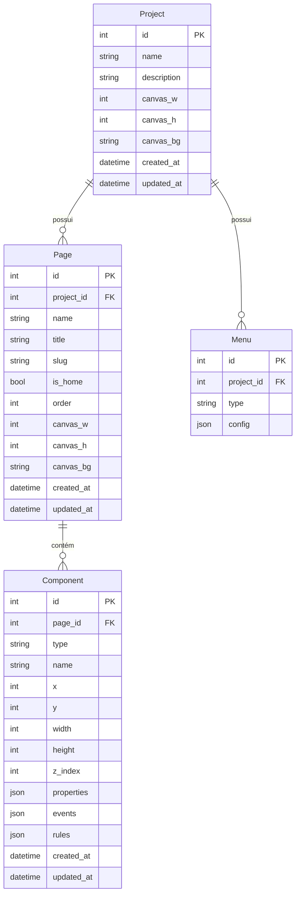
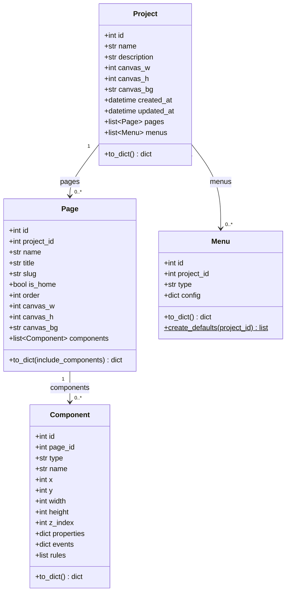

# 03 · Modelos de Dados

> 📍 [Início](./README.md) › Modelos de Dados

---

## 🗄️ Diagrama ER — Banco de Dados



---

## 📋 Detalhes dos Models

### Project
Entidade raiz. Cada projeto tem configurações globais de canvas e pode conter múltiplas páginas e menus.

| Campo | Tipo | Descrição |
|-------|------|-----------|
| `id` | Integer PK | Identificador único |
| `name` | String(200) | Nome do projeto |
| `description` | String(500) | Descrição opcional |
| `canvas_w` | Integer | Largura padrão do canvas (default: 1280) |
| `canvas_h` | Integer | Altura padrão do canvas (default: 900) |
| `canvas_bg` | String(20) | Cor de fundo padrão (default: `#ffffff`) |
| `created_at` | DateTime | Data de criação |
| `updated_at` | DateTime | Última atualização |

**Relacionamentos:**
- `pages` → 1:N Page (cascade delete)
- `menus` → 1:N Menu (cascade delete)

---

### Page
Cada projeto tem ao menos uma página (`is_home=True`). Pode sobrescrever as configurações de canvas do projeto.

| Campo | Tipo | Descrição |
|-------|------|-----------|
| `id` | Integer PK | Identificador único |
| `project_id` | Integer FK | Projeto pai |
| `name` | String(100) | Nome da página |
| `title` | String(200) | Título para o `<title>` HTML |
| `slug` | String(100) | Nome do arquivo no export (ex: `index`, `sobre`) |
| `is_home` | Boolean | Se é a página principal (não pode ser deletada) |
| `order` | Integer | Ordem de exibição |
| `canvas_w/h/bg` | Integer/String | Override do canvas do projeto (nullable) |

---

### Component
O componente é o átomo do sistema. Todos os dados de configuração são armazenados em JSON para máxima flexibilidade.

| Campo | Tipo | Descrição |
|-------|------|-----------|
| `id` | Integer PK | Identificador único |
| `page_id` | Integer FK | Página pai |
| `type` | String(50) | Tipo do componente (ex: `button`, `datagrid`) |
| `name` | String(100) | Nome único na página (ex: `btnSalvar`) |
| `x`, `y` | Integer | Posição no canvas (pixels) |
| `width`, `height` | Integer | Dimensões (pixels) |
| `z_index` | Integer | Camada (maior = frente) |
| `properties` | JSON | Todas as propriedades visuais e comportamentais |
| `events` | JSON | Mapeamento `{nomeEvento: codigoJS}` |
| `rules` | JSON | Lista de `{type, params}` |

**Exemplo de `properties` (button):**
```json
{
  "text": "Salvar",
  "variant": "primary",
  "bg_color": "#4154f1",
  "text_color": "#ffffff",
  "font_size": 14,
  "border_radius": 6,
  "disabled": false
}
```

**Exemplo de `events`:**
```json
{
  "onClick": "DSB.toast('Salvo!', 'success');",
  "onMouseEnter": "DSB.setProgress('pbStatus', 100);"
}
```

**Exemplo de `rules`:**
```json
[
  {"type": "obrigatorio", "params": {"message": "Campo obrigatório!"}},
  {"type": "email",       "params": {"message": "E-mail inválido."}}
]
```

---

### Menu
Armazena a configuração completa de menu e sidebar como JSON, permitindo customização por projeto.

| Campo | Tipo | Descrição |
|-------|------|-----------|
| `id` | Integer PK | Identificador único |
| `project_id` | Integer FK | Projeto pai |
| `type` | String(50) | `main` (barra de menus) ou `sidebar` |
| `config` | JSON | Estrutura completa do menu |

**Tipos disponíveis:**
- `main` → barra de menus superior (Arquivo, Editar, Visualizar...)
- `sidebar` → painel lateral esquerdo (seções e itens)

---

## 🐍 Class Diagram — Models Python



---

## 🐍 Class Diagram — Component System

```mermaid
classDiagram
    class BaseComponent {
        <<abstract>>
        +str type*
        +str label*
        +str icon*
        +str group
        +dict default_properties*
        +dict default_size
        +list available_events
        +list available_rules
        +render_html(comp_id, name, props, x, y, w, h, z)* str
        +render_css(comp_id, props) str
        +render_js(comp_id, events, rules) str
        +to_catalog_entry() dict
        +position_style(x, y, w, h, z, extra)$ str
    }

    class ButtonComponent {
        +str type = "button"
        +str group = "Entrada"
        +render_html() str
    }

    class DataGridComponent {
        +str type = "datagrid"
        +str group = "Dados"
        +render_html() str
    }

    class TimerComponent {
        +str type = "timer"
        +str group = "Tempo"
        +render_html() str
    }

    class ComponentRegistry {
        <<singleton>>
        +get(comp_type) dict
        +get_instance(comp_type) BaseComponent
        +get_catalog() list
        +all_types() list
        +render_component(comp_model) str
        +render_js(comp_model) str
        +render_css(comp_model) str
    }

    BaseComponent <|-- ButtonComponent
    BaseComponent <|-- DataGridComponent
    BaseComponent <|-- TimerComponent
    BaseComponent <|-- "...34 outros"
    ComponentRegistry --> BaseComponent : usa instâncias
```

---

## 🔑 Decisões de Design

### Por que JSON nas colunas `properties`, `events` e `rules`?
Armazenar propriedades como JSON elimina a necessidade de migrações toda vez que um novo tipo de componente é adicionado. O trade-off é a perda de consultas SQL filtradas por propriedade, mas como o sistema não precisa buscar componentes por cor de fundo, a escolha é adequada.

### Por que SQLite no desenvolvimento?
Simplicidade de setup: zero configuração, arquivo único, fácil para versionar em dev. A migration para PostgreSQL em produção é planejada para Sprint 7 via Flask-Migrate/Alembic.

### Por que `canvas_w/h/bg` em Page pode ser null?
Cada página pode sobrescrever as configurações do projeto pai ou herdar as do projeto. Null significa "use as configurações do projeto".

---

## 🔗 Navegação

| Anterior | Próximo |
|----------|---------|
| [← Arquitetura](./02_arquitetura.md) | [Componentes Visuais →](./04_componentes_visuais.md) |
