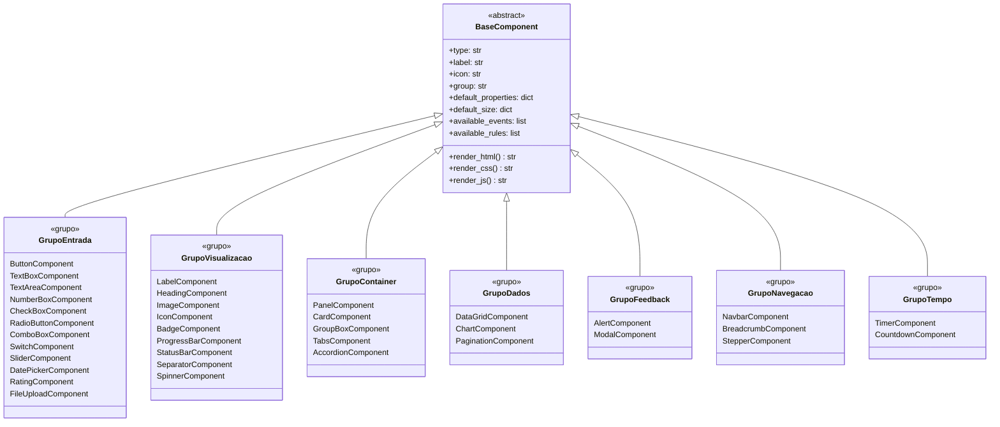

# 04 · Componentes Visuais

> 📍 [Início](./README.md) › Componentes Visuais

---

## 📊 Resumo por Grupo

| Grupo | Qtd | Componentes |
|-------|-----|-------------|
| **Entrada** | 12 | button, textbox, textarea, numberbox, checkbox, radiobutton, combobox, switch, slider, datepicker, rating, fileupload |
| **Visualização** | 9 | label, heading, image, icon, badge, progressbar, statusbar, separator, spinner |
| **Container** | 5 | panel, card, groupbox, tabs, accordion |
| **Dados** | 3 | datagrid, chart, pagination |
| **Feedback** | 2 | alert, modal |
| **Navegação** | 3 | navbar, breadcrumb, stepper |
| **Tempo** | 2 | timer, countdown |
| **Total** | **36** | |

---

## 🏗️ Hierarquia de Classes

---

## 📥 Grupo: Entrada

### `button` — Botão
**Ícone:** `bi-app` | **Tamanho padrão:** 150×40px

| Propriedade | Tipo | Padrão | Descrição |
|-------------|------|--------|-----------|
| `text` | string | `"Botão"` | Texto exibido |
| `variant` | select | `"primary"` | Variante Bootstrap (primary, secondary, success, danger, warning, info, outline-*) |
| `size` | select | `"md"` | Tamanho: sm, md, lg |
| `icon` | string | `""` | Classe Bootstrap Icon (ex: `bi-save`) |
| `icon_pos` | select | `"left"` | Posição do ícone: left, right |
| `disabled` | bool | `false` | Desabilitar botão |
| `full_width` | bool | `false` | Largura total (`w-100`) |
| `border_radius` | int | `4` | Raio da borda em px |
| `bg_color` | color | `#4154f1` | Cor de fundo customizada |
| `text_color` | color | `#ffffff` | Cor do texto |
| `font_size` | int | `14` | Tamanho da fonte em px |

**Eventos disponíveis:** `onClick`, `onDoubleClick`, `onMouseEnter`, `onMouseLeave`, `onFocus`, `onBlur`

---

### `textbox` — Campo de Texto
**Ícone:** `bi-input-cursor-text` | **Tamanho padrão:** 220×38px

| Propriedade | Tipo | Padrão | Descrição |
|-------------|------|--------|-----------|
| `placeholder` | string | `"Digite aqui..."` | Texto de ajuda |
| `value` | string | `""` | Valor inicial |
| `maxlength` | string | `""` | Limite de caracteres |
| `readonly` | bool | `false` | Somente leitura |
| `disabled` | bool | `false` | Desabilitado |
| `input_type` | select | `"text"` | Tipo: text, email, password, tel, url |
| `label` | string | `""` | Label acima do campo |
| `border_color` | color | `#ced4da` | Cor da borda |
| `border_radius` | int | `4` | Raio da borda |
| `font_size` | int | `14` | Tamanho da fonte |

**Eventos:** `onChange`, `onKeyUp`, `onKeyDown`, `onFocus`, `onBlur`, `onInput`  
**Regras:** `obrigatorio`, `min_length`, `max_length`, `email`, `cpf`, `cnpj`, `visivel_se`, `habilitado_se`

---

### `textarea` — Área de Texto
**Ícone:** `bi-textarea` | **Tamanho padrão:** 260×100px

| Propriedade | Tipo | Padrão | Descrição |
|-------------|------|--------|-----------|
| `placeholder` | string | `"Texto..."` | Texto de ajuda |
| `value` | string | `""` | Valor inicial |
| `rows` | int | `4` | Número de linhas |
| `resize` | select | `"vertical"` | Redimensionamento: none, vertical, horizontal, both |
| `font_size` | int | `14` | Tamanho da fonte |

---

### `numberbox` — Campo Numérico
**Ícone:** `bi-123` | **Tamanho padrão:** 160×38px

| Propriedade | Tipo | Padrão | Descrição |
|-------------|------|--------|-----------|
| `value` | string | `""` | Valor inicial |
| `min` | string | `""` | Valor mínimo |
| `max` | string | `""` | Valor máximo |
| `step` | int | `1` | Incremento |
| `placeholder` | string | `"0"` | Texto de ajuda |

**Regras:** `obrigatorio`, `min_valor`, `max_valor`, `visivel_se`, `habilitado_se`

---

### `checkbox` — CheckBox
**Ícone:** `bi-check-square` | **Tamanho padrão:** 160×30px

| Propriedade | Tipo | Padrão | Descrição |
|-------------|------|--------|-----------|
| `text` | string | `"Opção"` | Texto ao lado |
| `checked` | bool | `false` | Estado inicial |
| `disabled` | bool | `false` | Desabilitado |
| `font_size` | int | `14` | Tamanho da fonte |

---

### `radiobutton` — RadioButton
**Ícone:** `bi-record-circle` | **Tamanho padrão:** 160×30px

| Propriedade | Tipo | Padrão | Descrição |
|-------------|------|--------|-----------|
| `text` | string | `"Opção"` | Texto ao lado |
| `checked` | bool | `false` | Estado inicial |
| `group_name` | string | `"grupo1"` | Nome do grupo HTML (`name`) |
| `disabled` | bool | `false` | Desabilitado |

---

### `combobox` — ComboBox (Select)
**Ícone:** `bi-menu-button-wide` | **Tamanho padrão:** 220×38px

| Propriedade | Tipo | Padrão | Descrição |
|-------------|------|--------|-----------|
| `placeholder` | string | `"Selecione..."` | Opção vazia |
| `items` | array | `["Opção 1","Opção 2","Opção 3"]` | Lista de opções |
| `selected_value` | string | `""` | Valor selecionado |
| `disabled` | bool | `false` | Desabilitado |
| `font_size` | int | `14` | Tamanho da fonte |

---

### `switch` — Switch/Toggle
**Ícone:** `bi-toggle-on` | **Tamanho padrão:** 160×30px

| Propriedade | Tipo | Padrão | Descrição |
|-------------|------|--------|-----------|
| `text` | string | `"Ativado"` | Label ao lado |
| `checked` | bool | `false` | Estado inicial |
| `color` | color | `#4154f1` | Cor do toggle ativo |

---

### `slider` — Slider
**Ícone:** `bi-sliders` | **Tamanho padrão:** 240×40px

| Propriedade | Tipo | Padrão | Descrição |
|-------------|------|--------|-----------|
| `value` | int | `50` | Valor inicial |
| `min` | int | `0` | Valor mínimo |
| `max` | int | `100` | Valor máximo |
| `step` | int | `1` | Incremento |
| `show_value` | bool | `true` | Exibir valor atual |

---

### `datepicker` — Seletor de Data
**Ícone:** `bi-calendar3` | **Tamanho padrão:** 200×38px

| Propriedade | Tipo | Padrão | Descrição |
|-------------|------|--------|-----------|
| `value` | string | `""` | Data inicial (YYYY-MM-DD) |
| `min` | string | `""` | Data mínima |
| `max` | string | `""` | Data máxima |
| `label` | string | `""` | Label acima |

**Regras:** `obrigatorio`, `data_valida`, `visivel_se`, `habilitado_se`

---

### `rating` — Avaliação por Estrelas
**Ícone:** `bi-star-half` | **Tamanho padrão:** 150×36px

| Propriedade | Tipo | Padrão | Descrição |
|-------------|------|--------|-----------|
| `value` | int | `3` | Estrelas preenchidas |
| `max` | int | `5` | Total de estrelas |
| `color` | color | `#ffc107` | Cor das estrelas |
| `size` | int | `24` | Tamanho em px |

---

### `fileupload` — Upload de Arquivo
**Ícone:** `bi-upload` | **Tamanho padrão:** 220×38px

| Propriedade | Tipo | Padrão | Descrição |
|-------------|------|--------|-----------|
| `accept` | string | `"*/*"` | Tipos aceitos (ex: `image/*`, `.pdf`) |
| `multiple` | bool | `false` | Permitir múltiplos |
| `max_size_mb` | int | `10` | Tamanho máximo em MB |

---

## 👁️ Grupo: Visualização

### `label` — Texto / Parágrafo
**Ícone:** `bi-paragraph` | **Tamanho padrão:** 220×36px

| Propriedade | Tipo | Padrão | Descrição |
|-------------|------|--------|-----------|
| `text` | string | `"Texto parágrafo"` | Conteúdo |
| `tag` | select | `"p"` | Tag HTML: p, span, div, small, strong |
| `font_size` | int | `14` | Tamanho da fonte |
| `text_color` | color | `#333333` | Cor do texto |
| `bg_color` | color | `""` | Cor de fundo (opcional) |
| `bold` | bool | `false` | Negrito |
| `italic` | bool | `false` | Itálico |
| `text_align` | select | `"left"` | Alinhamento: left, center, right |
| `line_height` | float | `1.5` | Espaçamento entre linhas |

---

### `heading` — Título
**Ícone:** `bi-type-h1` | **Tamanho padrão:** 320×48px

| Propriedade | Tipo | Padrão | Descrição |
|-------------|------|--------|-----------|
| `text` | string | `"Título da Seção"` | Conteúdo |
| `tag` | select | `"h2"` | Tag HTML: h1, h2, h3, h4, h5, h6 |
| `font_size` | int | `26` | Tamanho da fonte |
| `text_color` | color | `#012970` | Cor do texto |
| `bold` | bool | `true` | Negrito |

---

### `image` — Imagem
**Ícone:** `bi-image` | **Tamanho padrão:** 300×200px

| Propriedade | Tipo | Padrão | Descrição |
|-------------|------|--------|-----------|
| `src` | string | placeholder URL | URL da imagem |
| `alt` | string | `"Imagem"` | Texto alternativo |
| `object_fit` | select | `"cover"` | Ajuste: cover, contain, fill, none |
| `border_radius` | int | `4` | Raio da borda |

---

### `icon` — Ícone Bootstrap Icons
**Ícone:** `bi-star` | **Tamanho padrão:** 50×50px

| Propriedade | Tipo | Padrão | Descrição |
|-------------|------|--------|-----------|
| `icon_class` | string | `"bi-star-fill"` | Classe Bootstrap Icon |
| `size` | int | `32` | Tamanho em px |
| `color` | color | `#4154f1` | Cor do ícone |

---

### `badge` — Badge
**Ícone:** `bi-tag` | **Tamanho padrão:** 70×28px

| Propriedade | Tipo | Padrão | Descrição |
|-------------|------|--------|-----------|
| `text` | string | `"Novo"` | Texto do badge |
| `variant` | select | `"primary"` | Variante Bootstrap |
| `pill` | bool | `false` | Formato pílula (`rounded-pill`) |
| `font_size` | int | `12` | Tamanho da fonte |

---

### `progressbar` — Barra de Progresso
**Ícone:** `bi-bar-chart-steps` | **Tamanho padrão:** 280×28px

| Propriedade | Tipo | Padrão | Descrição |
|-------------|------|--------|-----------|
| `value` | int | `60` | Valor atual |
| `min` | int | `0` | Valor mínimo |
| `max` | int | `100` | Valor máximo |
| `variant` | select | `"primary"` | Cor Bootstrap |
| `striped` | bool | `false` | Listrado |
| `animated` | bool | `false` | Animação (requer striped) |
| `show_text` | bool | `true` | Mostrar percentual |
| `height` | int | `20` | Altura em px |

**Eventos:** `onComplete`, `onProgress`  
**Regras:** `progresso` (vincula a campo numérico)

---

### `statusbar` — Barra de Status
**Ícone:** `bi-info-circle` | **Tamanho padrão:** 300×32px

| Propriedade | Tipo | Padrão | Descrição |
|-------------|------|--------|-----------|
| `text` | string | `"Pronto"` | Mensagem de status |
| `icon` | string | `"bi-check-circle"` | Ícone à esquerda |
| `bg_color` | color | `#d1e7dd` | Cor de fundo |
| `text_color` | color | `#0a3622` | Cor do texto |
| `font_size` | int | `13` | Tamanho da fonte |

**Regras:** `status_map` (mapeia valor de outro campo para texto)

---

### `separator` — Divisor
**Ícone:** `bi-hr` | **Tamanho padrão:** 300×8px

| Propriedade | Tipo | Padrão | Descrição |
|-------------|------|--------|-----------|
| `color` | color | `#dee2e6` | Cor da linha |
| `thickness` | int | `2` | Espessura em px |
| `style` | select | `"solid"` | Estilo: solid, dashed, dotted |

---

### `spinner` — Indicador de Carregamento
**Ícone:** `bi-arrow-repeat` | **Tamanho padrão:** 50×50px

| Propriedade | Tipo | Padrão | Descrição |
|-------------|------|--------|-----------|
| `variant` | select | `"primary"` | Cor Bootstrap |
| `size` | select | `"md"` | Tamanho: sm, md |
| `type` | select | `"border"` | Tipo: border, grow |

---

## 📦 Grupo: Container

### `panel` — Painel
**Ícone:** `bi-bounding-box` | **Tamanho padrão:** 320×180px

| Propriedade | Tipo | Padrão | Descrição |
|-------------|------|--------|-----------|
| `bg_color` | color | `#f8f9fa` | Cor de fundo |
| `border` | color | `#dee2e6` | Cor da borda |
| `padding` | string | `"16px"` | Padding interno |
| `border_radius` | int | `4` | Raio da borda |
| `shadow` | bool | `false` | Sombra suave |

---

### `card` — Card Bootstrap
**Ícone:** `bi-card-text` | **Tamanho padrão:** 300×200px

| Propriedade | Tipo | Padrão | Descrição |
|-------------|------|--------|-----------|
| `title` | string | `"Título do Card"` | Cabeçalho |
| `subtitle` | string | `""` | Subtítulo (opcional) |
| `body` | string | `"Conteúdo..."` | Conteúdo do card |
| `footer` | string | `""` | Rodapé (opcional) |
| `shadow` | bool | `true` | Sombra |
| `border_radius` | int | `8` | Raio da borda |
| `header_bg` | color | `#4154f1` | Cor do cabeçalho |
| `header_color` | color | `#ffffff` | Cor do texto do cabeçalho |

---

### `groupbox` — GroupBox
**Ícone:** `bi-collection` | **Tamanho padrão:** 300×160px

| Propriedade | Tipo | Padrão | Descrição |
|-------------|------|--------|-----------|
| `title` | string | `"Grupo"` | Texto da legenda |
| `bg_color` | color | `#ffffff` | Cor de fundo |
| `border` | color | `#ced4da` | Cor da borda |
| `font_size` | int | `13` | Tamanho da fonte da legenda |

---

### `tabs` — Abas (TabControl)
**Ícone:** `bi-folder-symlink` | **Tamanho padrão:** 400×200px

| Propriedade | Tipo | Padrão | Descrição |
|-------------|------|--------|-----------|
| `tabs` | array | `["Aba 1","Aba 2","Aba 3"]` | Nomes das abas |
| `active_tab` | int | `0` | Índice da aba ativa |
| `variant` | select | `"tabs"` | Estilo: tabs, pills |

**Eventos:** `onTabChange`

---

### `accordion` — Accordion
**Ícone:** `bi-layout-accordion-collapsed` | **Tamanho padrão:** 360×150px

| Propriedade | Tipo | Padrão | Descrição |
|-------------|------|--------|-----------|
| `sections` | array | `["Seção 1","Seção 2","Seção 3"]` | Títulos das seções |
| `flush` | bool | `false` | Estilo flush (sem bordas laterais) |

---

## 📊 Grupo: Dados

### `datagrid` — Tabela de Dados
**Ícone:** `bi-table` | **Tamanho padrão:** 480×200px

| Propriedade | Tipo | Padrão | Descrição |
|-------------|------|--------|-----------|
| `columns` | array | `["ID","Nome","Valor"]` | Nomes das colunas |
| `rows` | array | `[["1","Item A","R$10"]]` | Dados estáticos |
| `striped` | bool | `true` | Linhas alternadas |
| `hover` | bool | `true` | Destaque ao passar mouse |
| `bordered` | bool | `false` | Bordas em todas as células |
| `small` | bool | `false` | Versão compacta |
| `sortable` | bool | `true` | Ordenação por coluna |
| `searchable` | bool | `false` | Campo de busca |

**Eventos:** `onRowClick`, `onCellEdit`, `onSort`

---

### `chart` — Gráfico (Chart.js)
**Ícone:** `bi-bar-chart` | **Tamanho padrão:** 400×260px

| Propriedade | Tipo | Padrão | Descrição |
|-------------|------|--------|-----------|
| `chart_type` | select | `"bar"` | Tipo: bar, line, pie, doughnut |
| `labels` | array | `["Jan","Fev","Mar"...]` | Labels do eixo X |
| `data` | array | `[12,19,3,5,2,3]` | Dados |
| `label` | string | `"Dados"` | Legenda do dataset |
| `color` | color | `#4154f1` | Cor das barras/linhas |

---

### `pagination` — Paginação
**Ícone:** `bi-arrow-left-right` | **Tamanho padrão:** 280×40px

| Propriedade | Tipo | Padrão | Descrição |
|-------------|------|--------|-----------|
| `total` | int | `50` | Total de registros |
| `per_page` | int | `10` | Registros por página |
| `current` | int | `1` | Página atual |
| `size` | select | `"md"` | Tamanho: sm, md, lg |

**Eventos:** `onPageChange`

---

## 💬 Grupo: Feedback

### `alert` — Alerta
**Ícone:** `bi-info-circle` | **Tamanho padrão:** 340×56px

| Propriedade | Tipo | Padrão | Descrição |
|-------------|------|--------|-----------|
| `text` | string | `"Mensagem de alerta."` | Conteúdo |
| `variant` | select | `"info"` | Variante: info, success, warning, danger, primary... |
| `dismissible` | bool | `false` | Botão de fechar |
| `icon` | string | `"bi-info-circle-fill"` | Ícone |
| `font_size` | int | `14` | Tamanho da fonte |

---

### `modal` — Dialog/Modal
**Ícone:** `bi-window-stack` | **Tamanho padrão:** 200×40px

| Propriedade | Tipo | Padrão | Descrição |
|-------------|------|--------|-----------|
| `title` | string | `"Título do Dialog"` | Título |
| `body` | string | `"Conteúdo..."` | Corpo do modal |
| `size` | select | `"md"` | Tamanho: sm, md, lg, xl |
| `close_on_backdrop` | bool | `true` | Fechar ao clicar fora |
| `trigger_label` | string | `"Abrir Dialog"` | Texto do botão trigger |

**Eventos:** `onOpen`, `onClose`, `onConfirm`, `onCancel`

---

## 🧭 Grupo: Navegação

### `navbar` — Barra de Navegação
**Ícone:** `bi-layout-text-sidebar-reverse` | **Tamanho padrão:** 600×56px

| Propriedade | Tipo | Padrão | Descrição |
|-------------|------|--------|-----------|
| `brand` | string | `"Meu Site"` | Nome/logo |
| `links` | array | `["Início","Sobre","Contato"]` | Links de navegação |
| `variant` | select | `"dark"` | Tema: dark, light |
| `bg` | string | `"primary"` | Cor de fundo Bootstrap |
| `expand` | string | `"lg"` | Breakpoint de colapso |

---

### `breadcrumb` — Trilha de Navegação
**Ícone:** `bi-chevron-right` | **Tamanho padrão:** 280×32px

| Propriedade | Tipo | Padrão | Descrição |
|-------------|------|--------|-----------|
| `items` | array | `["Início","Produtos","Detalhe"]` | Itens da trilha |

---

### `stepper` — Indicador de Passos
**Ícone:** `bi-list-ol` | **Tamanho padrão:** 480×60px

| Propriedade | Tipo | Padrão | Descrição |
|-------------|------|--------|-----------|
| `steps` | array | `["Dados","Endereço","Pagamento","Confirmação"]` | Passos |
| `current` | int | `1` | Passo ativo (1-based) |
| `variant` | string | `"primary"` | Cor Bootstrap |

**Eventos:** `onStepChange`

---

## ⏱️ Grupo: Tempo

### `timer` — Timer / Disparador de Intervalo
**Ícone:** `bi-alarm` | **Tamanho padrão:** 150×40px

| Propriedade | Tipo | Padrão | Descrição |
|-------------|------|--------|-----------|
| `interval_ms` | int | `1000` | Intervalo em milissegundos |
| `enabled` | bool | `false` | Iniciar automaticamente |
| `repeat` | bool | `true` | Repetir indefinidamente |
| `label` | string | `"Timer1"` | Identificador visual |

**Eventos:** `onTick` (disparado a cada intervalo)

**Uso típico:** Atualizar um DataGrid a cada 5s, incrementar uma ProgressBar, disparar uma função periodicamente.

---

### `countdown` — Contagem Regressiva
**Ícone:** `bi-stopwatch` | **Tamanho padrão:** 150×60px

| Propriedade | Tipo | Padrão | Descrição |
|-------------|------|--------|-----------|
| `seconds` | int | `60` | Total de segundos |
| `format` | string | `"MM:SS"` | Formato de exibição |
| `auto_start` | bool | `false` | Iniciar automaticamente |
| `font_size` | int | `32` | Tamanho da fonte |
| `color` | color | `#4154f1` | Cor do contador |

**Eventos:** `onTick`, `onComplete`

---

## 🔗 Navegação

| Anterior | Próximo |
|----------|---------|
| [← Modelos de Dados](./03_modelos_dados.md) | [Sistema de Eventos →](./05_sistema_eventos.md) |
