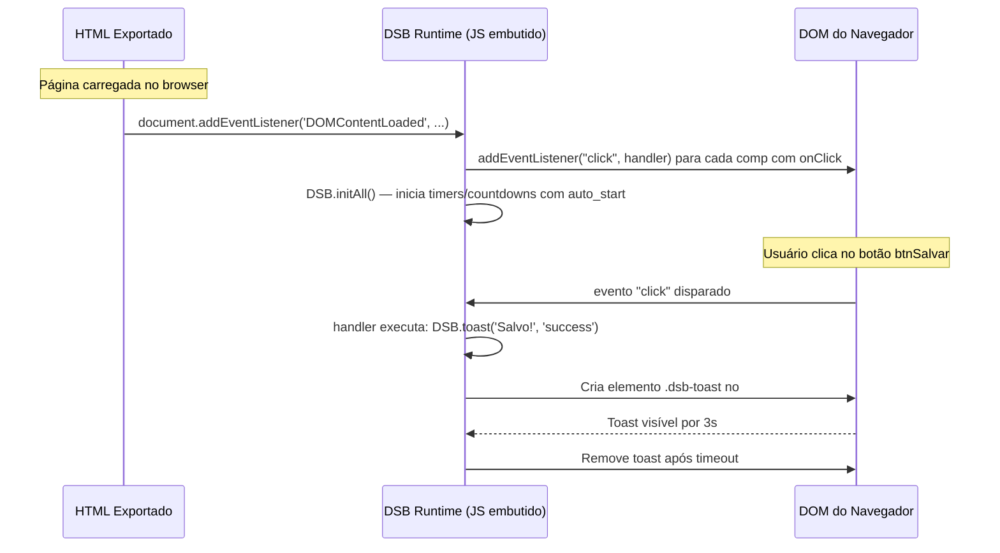
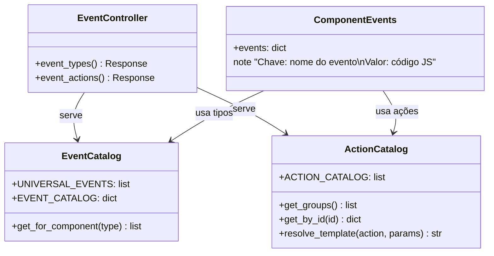

# 05 · Sistema de Eventos

> 📍 [Início](./README.md) › Sistema de Eventos

---

## 🎯 Visão Geral

O sistema de eventos conecta **ações do usuário** no browser a **comportamentos programáticos** sem que o desenvolvedor escreva JavaScript manualmente. Cada evento de um componente pode ter um código JS associado — seja uma ação pré-definida ou código customizado.

```mermaid
stateDiagram-v2
    direction LR
    [*] --> ComponenteSelecionado : Clique no canvas
    ComponenteSelecionado --> AbaEventos : Clique na aba ⚡
    AbaEventos --> ModalEvento : Clique em "+ Adicionar Evento"
    ModalEvento --> EventoEscolhido : Seleciona tipo (ex: onClick)
    EventoEscolhido --> AcaoEscolhida : Seleciona ação pré-definida
    AcaoEscolhida --> CodigoGerado : Preenche parâmetros
    CodigoGerado --> EventoSalvo : Clique "Salvar Evento"
    EventoSalvo --> ComponenteSalvo : Ctrl+S
    ComponenteSalvo --> ExportGerado : Export ZIP
    ExportGerado --> [*] : Evento funcional no HTML

    note right of CodigoGerado
        Também aceita código JS
        personalizado diretamente
    end note
```



---

## 📋 Categorias de Eventos

### Eventos Universais
Disponíveis em **todos** os componentes:

| Nome | Evento DOM | Descrição |
|------|-----------|-----------|
| `onClick` | `click` | Clique com botão esquerdo |
| `onDoubleClick` | `dblclick` | Duplo clique |
| `onMouseEnter` | `mouseenter` | Mouse entrou na área |
| `onMouseLeave` | `mouseleave` | Mouse saiu da área |
| `onRightClick` | `contextmenu` | Clique com botão direito |
| `onFocus` | `focus` | Ganhou foco |
| `onBlur` | `blur` | Perdeu foco |

---

### Eventos por Categoria

| Categoria | Eventos Disponíveis |
|-----------|-------------------|
| **input** | `onChange`, `onKeyUp`, `onKeyDown`, `onInput`, `onEnterPress` |
| **datagrid** | `onRowClick`, `onCellEdit`, `onSort`, `onFilter` |
| **progressbar** | `onComplete`, `onProgress` |
| **timer** | `onTick` |
| **countdown** | `onTick`, `onComplete` |
| **modal** | `onOpen`, `onClose`, `onConfirm`, `onCancel` |
| **tabs** | `onTabChange` |
| **accordion** | `onSectionChange` |
| **form** | `onLoad`, `onUnload`, `onBeforeSave`, `onAfterSave` |
| **scroll** | `onScroll` |

---

## ⚡ Ações Pré-definidas

### Grupo: Navegação
| ID | Label | Template JS |
|----|-------|-------------|
| `nav_url` | Navegar para URL | `window.location.href = '{url}';` |
| `nav_page` | Abrir Página do Projeto | `window.location.href = '{page}';` |
| `nav_back` | Voltar | `window.history.back();` |

### Grupo: Interface
| ID | Label | Template JS |
|----|-------|-------------|
| `show_msg` | Mostrar Mensagem | `DSB.toast('{msg}', '{type}');` |
| `open_modal` | Abrir Modal | `new bootstrap.Modal(document.getElementById('{id}_m')).show();` |
| `close_modal` | Fechar Modal Atual | `bootstrap.Modal.getInstance(document.querySelector('.modal.show'))?.hide();` |
| `toggle_visible` | Mostrar/Ocultar | `DSB.toggleVisible('{id}');` |
| `set_visible` | Definir Visibilidade | `DSB.setVisible('{id}', {visible});` |
| `set_enabled` | Habilitar/Desabilitar | `DSB.setEnabled('{id}', {enabled});` |
| `focus_comp` | Focar Componente | `document.getElementById('{id}')?.focus();` |

### Grupo: Valores
| ID | Label | Template JS |
|----|-------|-------------|
| `set_value` | Definir Valor | `DSB.setValue('{id}', '{value}');` |
| `clear_field` | Limpar Campo | `DSB.setValue('{id}', '');` |
| `set_text` | Definir Texto/Label | `DSB.setText('{id}', '{text}');` |
| `set_progress` | Definir Progresso | `DSB.setProgress('{id}', {val});` |

### Grupo: Timer
| ID | Label | Template JS |
|----|-------|-------------|
| `start_timer` | Iniciar Timer | `DSB.startTimer('{id}', {ms});` |
| `stop_timer` | Parar Timer | `DSB.stopTimer('{id}');` |
| `start_countdown` | Iniciar Countdown | `DSB.startCountdown('{id}');` |

### Grupo: Dados / API
| ID | Label | Template JS |
|----|-------|-------------|
| `call_api` | Chamar API | `DSB.callApi('{url}', '{method}', '{target}');` |
| `export_pdf` | Exportar PDF | `window.print();` |
| `export_csv` | Exportar CSV da Grid | `DSB.exportCsv('{id}');` |

### Grupo: Validação
| ID | Label | Template JS |
|----|-------|-------------|
| `validate_form` | Validar Formulário | `DSB.validateAll();` |
| `clear_validations` | Limpar Validações | `DSB.clearValidations();` |

### Grupo: JavaScript Livre
| ID | Label | Uso |
|----|-------|-----|
| `custom_js` | Código JavaScript Livre | Qualquer código JS personalizado |

---

## 🔄 Sequence Diagram — Adição de Evento no Designer

```mermaid
sequenceDiagram
    actor Dev as Developer
    participant UI as Designer UI
    participant JS as designer.js (EventsPanel)
    participant API as Flask API
    participant DB as SQLite

    Dev->>UI: Seleciona componente (click)
    UI->>JS: DesignerCtrl.select(uid)
    JS->>UI: Atualiza painéis (Props, Eventos, Regras)
    Dev->>UI: Clica aba ⚡ Eventos
    UI->>JS: EventsPanel.load(comp)
    JS->>UI: Renderiza lista de eventos do componente

    Dev->>UI: Clica "+ Adicionar Evento"
    UI->>JS: EventsPanel._attachBtns() — abre modal
    JS->>API: GET /api/eventos/tipos
    API-->>JS: {universal: [...], input: [...], ...}
    JS->>API: GET /api/eventos/acoes
    API-->>JS: [{group, actions: [{id, label, params, template}]}]
    JS->>UI: Popula <select> de eventos e ações

    Dev->>UI: Seleciona "onClick" + "Mostrar Mensagem"
    UI->>JS: selAction change → preenche parâmetros
    JS->>UI: Renderiza campos de parâmetro (msg, type)
    Dev->>UI: Preenche "Salvo com sucesso!" / "success"
    JS->>UI: Gera código: DSB.toast('Salvo com sucesso!', 'success');
    Dev->>UI: Clica "Salvar Evento"
    JS->>JS: comp.events["onClick"] = código gerado
    JS->>UI: Atualiza lista de eventos
    JS->>JS: DesignerState.dirty = true

    Dev->>UI: Ctrl+S
    JS->>API: POST /api/paginas/<pgid>/salvar
    Note over JS,API: payload inclui components com events
    API->>DB: UPDATE/INSERT components
    DB-->>API: OK
    API-->>JS: {ok: true, saved_at: "14:32:15"}
    JS->>UI: Exibe "✓ Salvo 14:32:15"
```



---

## 🔄 Sequence Diagram — Execução de Evento no Export



---

## 🛠️ DSB Runtime — API Disponível no Export

O HTML exportado inclui automaticamente o objeto `DSB` com os seguintes métodos:

```javascript
// Notificações
DSB.toast(msg, type, duration)    // type: 'info'|'success'|'warning'|'error'

// Campos
DSB.val(id)                        // lê valor de qualquer campo
DSB.setValue(id, value)            // define valor
DSB.setText(id, text)              // define textContent
DSB.setVisible(id, visible)        // mostra/oculta
DSB.toggleVisible(id)              // alterna visibilidade
DSB.setEnabled(id, enabled)        // habilita/desabilita
DSB.setProgress(id, pct)           // atualiza ProgressBar

// Timers
DSB.startTimer(id, ms)             // inicia timer com intervalo
DSB.stopTimer(id)                  // para timer
DSB.startCountdown(id)             // inicia countdown

// Regras
DSB.rules.required(el, msg)
DSB.rules.email(el, msg)
DSB.rules.cpf(el, msg)
DSB.rules.cnpj(el, msg)
DSB.rules.minLength(el, min, msg)
DSB.rules.maxLength(el, max, msg)
DSB.rules.minValue(el, min, msg)
DSB.rules.maxValue(el, max, msg)
DSB.rules.validDate(el, msg)
DSB.rules.visibleIf(el, srcId, op, val)
DSB.rules.hiddenIf(el, srcId, op, val)
DSB.rules.enabledIf(el, srcId, op, val)
DSB.rules.calculate(targetId, fn)
DSB.rules.sum(ids, targetId)
DSB.rules.linkProgress(srcId, min, max, targetId)
DSB.rules.statusMap(srcId, mapping, targetId)
DSB.rules.format(srcId, fmt, targetId)

// Utilitários
DSB.validateAll()                  // executa todas as regras de validação
DSB.clearValidations()             // limpa erros de validação
DSB.callApi(url, method, targetId) // fetch e preenche campo alvo
DSB.exportCsv(gridId)              // exporta DataGrid como CSV
```

---

## 📐 Class Diagram — Sistema de Eventos (Python)



---

## 🔗 Navegação

| Anterior | Próximo |
|----------|---------|
| [← Componentes Visuais](./04_componentes_visuais.md) | [Sistema de Regras →](./06_sistema_regras.md) |
