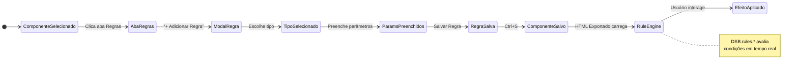
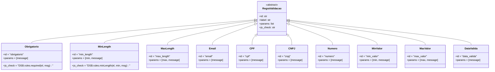
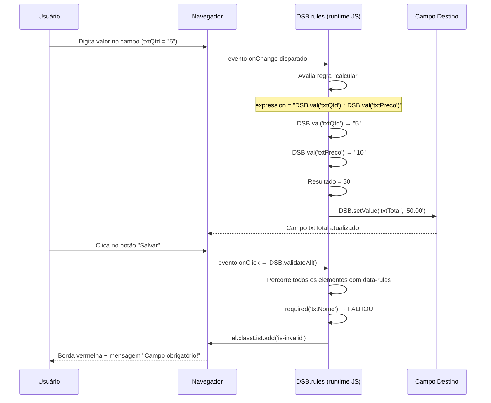
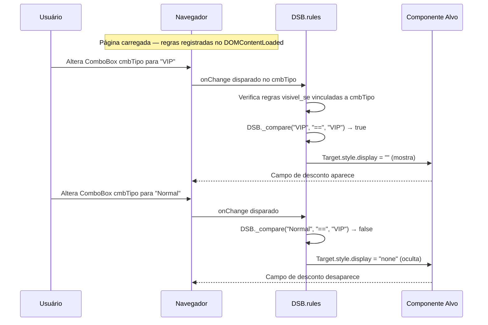

# 06 · Sistema de Regras de Negócio

> 📍 [Início](./README.md) › Sistema de Regras

---

## 🎯 Visão Geral

O Sistema de Regras permite declarar **comportamentos automáticos** nos componentes sem escrever código. As regras são avaliadas em runtime pelo objeto `DSB.rules` embutido no HTML exportado.



---

## 📋 Catálogo de Regras

### Grupo: Validação



| ID | Label | Parâmetros | Componentes Aplicáveis |
|----|-------|-----------|----------------------|
| `obrigatorio` | Campo Obrigatório | `message` | textbox, textarea, combobox, datepicker |
| `min_length` | Tamanho Mínimo | `min`, `message` | textbox, textarea |
| `max_length` | Tamanho Máximo | `max`, `message` | textbox, textarea |
| `email` | Formato E-mail | `message` | textbox (type=email) |
| `cpf` | CPF Válido | `message` | textbox, maskedinput |
| `cnpj` | CNPJ Válido | `message` | textbox, maskedinput |
| `numero` | Apenas Números | `message` | textbox, numberbox |
| `min_valor` | Valor Mínimo | `min`, `message` | numberbox, slider |
| `max_valor` | Valor Máximo | `max`, `message` | numberbox, slider |
| `data_valida` | Data Válida | `message` | datepicker |

---

### Grupo: Visibilidade

| ID | Label | Parâmetros | Descrição |
|----|-------|-----------|-----------|
| `visivel_se` | Visível Se | `source_id`, `operator`, `value` | Mostra o componente quando condição for verdadeira |
| `oculto_se` | Oculto Se | `source_id`, `operator`, `value` | Oculta o componente quando condição for verdadeira |
| `habilitado_se` | Habilitado Se | `source_id`, `operator`, `value` | Habilita/desabilita baseado em condição |

**Operadores disponíveis:** `==`, `!=`, `>`, `<`, `>=`, `<=`, `contains`, `filled`, `empty`

**Exemplo — "Mostrar campo desconto se tipo = 'VIP'":**
```json
{
  "type": "visivel_se",
  "params": {
    "source_id": "cmbTipo",
    "operator": "==",
    "value": "VIP"
  }
}
```

---

### Grupo: Cálculo

| ID | Label | Parâmetros | Descrição |
|----|-------|-----------|-----------|
| `calcular` | Calcular Expressão | `expression`, `target_id` | Avalia expressão JS e coloca resultado no destino |
| `somar` | Somar Campos | `ids` (separados por vírgula), `target_id` | Soma valores numéricos de vários campos |
| `progresso` | Controlar ProgressBar | `source_id`, `min`, `max`, `target_id` | Vincula campo numérico a barra de progresso |
| `status_map` | Mapear Status | `source_id`, `mapping` (JSON), `target_id` | Converte valor em texto via mapeamento |
| `formatar` | Formatar Valor | `source_id`, `format`, `target_id` | Aplica máscara de formato ao valor |

**Exemplo — "Calcular total = quantidade × preço":**
```json
{
  "type": "calcular",
  "params": {
    "expression": "DSB.val('txtQtd') * DSB.val('txtPreco')",
    "target_id": "txtTotal"
  }
}
```

**Exemplo — "Somar campos de despesas":**
```json
{
  "type": "somar",
  "params": {
    "ids": "txtAluguel,txtContas,txtAlimentacao",
    "target_id": "txtTotalDespesas"
  }
}
```

**Exemplo — "Mapear código de status para texto":**
```json
{
  "type": "status_map",
  "params": {
    "source_id": "cmbStatus",
    "mapping": "{\"1\":\"Ativo\",\"0\":\"Inativo\",\"2\":\"Pendente\"}",
    "target_id": "stBarStatus"
  }
}
```

---

## 🔄 Sequence Diagram — Execução de Regras em Runtime



---

## 🔄 Sequence Diagram — Regra de Visibilidade



---

## 🧮 Operadores de Comparação

| Operador | Descrição | Exemplo |
|----------|-----------|---------|
| `==` | Igual | `valor == "sim"` |
| `!=` | Diferente | `status != "inativo"` |
| `>` | Maior que | `quantidade > 10` |
| `<` | Menor que | `preco < 100` |
| `>=` | Maior ou igual | `nota >= 7` |
| `<=` | Menor ou igual | `desconto <= 50` |
| `contains` | Contém substring | `nome contains "Silva"` |
| `filled` | Campo preenchido | *(sem value)* |
| `empty` | Campo vazio | *(sem value)* |

---

## 🗃️ Armazenamento das Regras

As regras são armazenadas como JSON no campo `rules` do model `Component`:

```json
[
  {
    "type": "obrigatorio",
    "params": { "message": "Nome é obrigatório!" }
  },
  {
    "type": "min_length",
    "params": { "min": "3", "message": "Mínimo 3 caracteres." }
  },
  {
    "type": "visivel_se",
    "params": {
      "source_id": "comp_cmbTipo",
      "operator": "==",
      "value": "PJ"
    }
  }
]
```

---

## 📐 Como Adicionar Novas Regras

1. Abra `rules/rule_types.py`
2. Adicione um novo objeto ao grupo adequado em `RULE_CATALOG`:

```python
{
    "id":       "minha_regra",
    "label":    "Minha Regra",
    "icon":     "bi-stars",
    "params":   [
        {"name": "param1", "label": "Parâmetro 1", "type": "text",   "default": ""},
        {"name": "param2", "label": "Parâmetro 2", "type": "number", "default": "0"},
    ],
    "js_check": "DSB.rules.minhaRegra(el, '{param1}', {param2})",
    "description": "Descrição da regra."
}
```

3. Implemente `DSB.rules.minhaRegra` no método `_dsb_runtime()` de `generators/html_generator.py`.
4. Nenhuma outra mudança necessária — o endpoint `/api/regras/tipos` a serve automaticamente.

---

## 🔗 Navegação

| Anterior | Próximo |
|----------|---------|
| [← Sistema de Eventos](./05_sistema_eventos.md) | [API & Endpoints →](./07_api_endpoints.md) |
