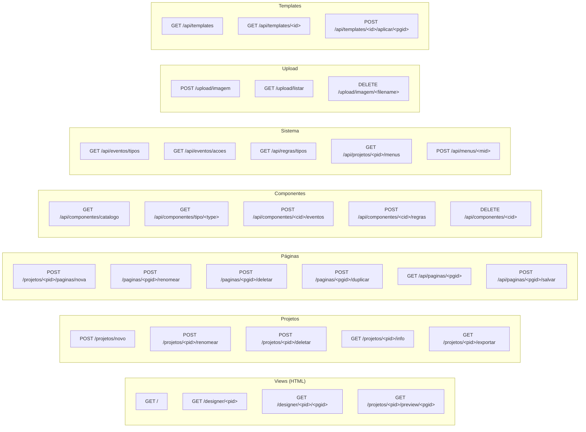

# 07 · API & Endpoints HTTP

> 📍 [Início](./README.md) › API & Endpoints

---

## 🗺️ Mapa de Rotas



---

## 📄 Referência Completa de Endpoints

---

### Views (Renderização HTML)

#### `GET /`
Renderiza o dashboard com a lista de projetos.

**Response:** HTML (`dashboard.html`)

---

#### `GET /designer/<pid>`
Redireciona para o designer da página inicial do projeto.

**Response:** `302 Redirect` → `GET /designer/<pid>/<home_pgid>`

---

#### `GET /designer/<pid>/<pgid>`
Abre o designer visual para a página especificada.

**Response:** HTML (`designer.html`)  
**Template variables:**
- `project` — objeto Project
- `current_page` — objeto Page
- `all_pages` — lista de Pages do projeto
- `registry` — catálogo de componentes
- `menu_config` — configuração JSON do menu

---

#### `GET /projetos/<pid>/preview/<pgid>`
Gera e retorna o HTML completo da página para preview.

**Response:** `text/html` — HTML gerado com runtime DSB embutido

---

---

### Projetos

#### `POST /projetos/novo`
Cria um novo projeto com uma página inicial e menus padrão.

**Body:** `multipart/form-data`
```
name: string  (nome do projeto)
```

**Response:** `200 JSON`
```json
{
  "id": 1,
  "name": "Meu Projeto",
  "canvas_w": 1280,
  "canvas_h": 900,
  "canvas_bg": "#ffffff",
  "created_at": "22/04/2026 14:30",
  "updated_at": "22/04/2026 14:30",
  "page_count": 1
}
```

---

#### `POST /projetos/<pid>/renomear`
Renomeia um projeto existente.

**Body:** `application/json`
```json
{ "name": "Novo Nome do Projeto" }
```

**Response:** `200 JSON` — objeto Project atualizado

---

#### `POST /projetos/<pid>/deletar`
Remove permanentemente o projeto e todos seus dados (cascade).

**Response:** `200 JSON`
```json
{ "ok": true, "deleted_id": 1 }
```

---

#### `GET /projetos/<pid>/info`
Retorna dados completos do projeto incluindo todas as páginas.

**Response:** `200 JSON`
```json
{
  "id": 1,
  "name": "Meu Projeto",
  "canvas_w": 1280,
  "canvas_h": 900,
  "canvas_bg": "#ffffff",
  "page_count": 3,
  "pages": [
    { "id": 1, "name": "Início", "is_home": true, "slug": "index" },
    { "id": 2, "name": "Sobre",  "is_home": false, "slug": "sobre" }
  ]
}
```

---

#### `GET /projetos/<pid>/exportar`
Gera e faz download do ZIP com todas as páginas exportadas.

**Response:** `application/zip` — arquivo `<nome-projeto>.zip`  
**Conteúdo do ZIP:**
```
index.html      ← página home
sobre.html      ← demais páginas
style.css       ← CSS consolidado
app.js          ← JS consolidado (eventos + regras)
README.txt
```

---

### Páginas

#### `POST /projetos/<pid>/paginas/nova`
Cria uma nova página no projeto.

**Body:** `application/json`
```json
{ "name": "Nova Página" }
```

**Response:** `200 JSON` — objeto Page criado
```json
{
  "id": 3,
  "project_id": 1,
  "name": "Nova Página",
  "slug": "nova-pagina",
  "is_home": false,
  "order": 2
}
```

---

#### `POST /paginas/<pgid>/renomear`
Renomeia uma página.

**Body:** `application/json`
```json
{ "name": "Novo Nome", "title": "Título HTML" }
```

---

#### `POST /paginas/<pgid>/deletar`
Remove uma página (não funciona para `is_home=True`).

**Response:** `200 JSON`
```json
{ "ok": true, "project_id": 1 }
```

**Erro se tentar deletar home:**
```json
{ "ok": false, "error": "Não é possível deletar a página inicial." }
```

---

#### `POST /paginas/<pgid>/duplicar`
Clona uma página com todos os seus componentes.

**Response:** `200 JSON`
```json
{
  "ok": true,
  "page": {
    "id": 4,
    "name": "Cópia de Início",
    "slug": "copia-de-inicio"
  },
  "comp_cloned": 10,
  "redirect_url": "/designer/1/4"
}
```

---

#### `GET /api/paginas/<pgid>`
Retorna dados completos da página com todos os componentes.

**Response:** `200 JSON`
```json
{
  "id": 1,
  "name": "Início",
  "canvas_bg": "#ffffff",
  "canvas_w": 1280,
  "canvas_h": 900,
  "components": [
    {
      "id": 1,
      "type": "button",
      "name": "btnSalvar",
      "x": 100, "y": 50,
      "width": 150, "height": 40,
      "z_index": 1,
      "properties": { "text": "Salvar", "variant": "primary" },
      "events": { "onClick": "DSB.toast('OK!', 'success');" },
      "rules": []
    }
  ]
}
```

---

#### `POST /api/paginas/<pgid>/salvar`
Substitui todos os componentes da página pelo payload recebido.

**Body:** `application/json`
```json
{
  "canvas_bg": "#f6f9ff",
  "canvas_w": 1280,
  "canvas_h": 900,
  "components": [
    {
      "id": 1,
      "type": "button",
      "name": "btnSalvar",
      "x": 100, "y": 50,
      "width": 150, "height": 40,
      "z_index": 1,
      "properties": { "text": "Salvar" },
      "events": {},
      "rules": []
    }
  ]
}
```

**Estratégia de upsert:**
- Componentes com `id` existente → atualiza
- Componentes sem `id` ou `id` novo → cria
- Componentes ausentes no payload → deleta

**Response:** `200 JSON`
```json
{ "ok": true, "saved_at": "14:32:15" }
```

---

### Componentes

#### `GET /api/componentes/catalogo`
Retorna o catálogo completo de tipos de componentes, agrupado.

**Response:** `200 JSON`
```json
[
  {
    "group": "Entrada",
    "items": [
      {
        "type": "button",
        "label": "Botão",
        "icon": "bi-app",
        "group": "Entrada",
        "default_properties": { "text": "Botão", "variant": "primary", ... },
        "default_size": { "width": 150, "height": 40 },
        "available_events": ["onClick", "onDoubleClick", ...],
        "available_rules": ["visivel_se", "habilitado_se"]
      }
    ]
  }
]
```

---

#### `GET /api/componentes/tipo/<type>`
Retorna defaults de um tipo específico.

**Response:** `200 JSON` ou `404 JSON { "error": "Tipo não encontrado" }`

---

#### `POST /api/componentes/<cid>/eventos`
Salva o mapa de eventos de um componente individualmente.

**Body:** `application/json`
```json
{ "events": { "onClick": "DSB.toast('OK!', 'success');" } }
```

---

#### `POST /api/componentes/<cid>/regras`
Salva a lista de regras de um componente.

**Body:** `application/json`
```json
{
  "rules": [
    { "type": "obrigatorio", "params": { "message": "Campo obrigatório!" } }
  ]
}
```

---

#### `DELETE /api/componentes/<cid>`
Remove um componente pelo ID do banco.

**Response:** `200 JSON { "ok": true }`

---

### Sistema (Catálogos)

#### `GET /api/eventos/tipos`
Retorna catálogo de tipos de eventos por categoria.

#### `GET /api/eventos/acoes`
Retorna todas as ações pré-definidas disponíveis.

#### `GET /api/regras/tipos`
Retorna catálogo de regras com parâmetros e descrição.

#### `GET /api/projetos/<pid>/menus`
Retorna todos os menus do projeto.

#### `POST /api/menus/<mid>`
Atualiza a configuração JSON de um menu.

---

### Upload de Imagens

#### `POST /upload/imagem`
Faz upload de uma imagem.

**Body:** `multipart/form-data`
```
file: arquivo de imagem (PNG, JPG, JPEG, GIF, WEBP, SVG — máx. 5MB)
```

**Response:** `200 JSON`
```json
{
  "ok": true,
  "url": "/static/uploads/20260422_143215_a1b2c3d4.png",
  "filename": "20260422_143215_a1b2c3d4.png",
  "size_kb": 42.3
}
```

**Erros:**
```json
{ "ok": false, "error": "Extensão não permitida. Use: png, jpg, jpeg, gif, webp, svg" }
{ "ok": false, "error": "Arquivo muito grande. Máximo: 5MB" }
```

---

#### `GET /upload/listar`
Lista imagens disponíveis.

**Response:** `200 JSON`
```json
{
  "ok": true,
  "count": 3,
  "images": [
    { "filename": "...", "url": "/static/uploads/...", "size_kb": 42.3, "modified": 1714000000 }
  ]
}
```

---

#### `DELETE /upload/imagem/<filename>`
Remove uma imagem. Sanitiza o nome para prevenir path traversal.

**Response:** `200 JSON { "ok": true, "deleted": "arquivo.png" }`

---

### Templates

#### `GET /api/templates`
Lista resumo de todos os templates (sem os componentes).

**Response:** `200 JSON`
```json
{
  "ok": true,
  "templates": [
    {
      "id": "login_form",
      "name": "Formulário de Login",
      "description": "...",
      "icon": "bi-door-open",
      "category": "Formulário",
      "comp_count": 7
    }
  ]
}
```

---

#### `GET /api/templates/<id>`
Retorna um template completo com todos os componentes.

---

#### `POST /api/templates/<id>/aplicar/<pgid>`
Aplica um template a uma página existente.

**Body:** `application/json`
```json
{ "keep_existing": false }
```

**Response:** `200 JSON`
```json
{
  "ok": true,
  "template_id": "dashboard_kpi",
  "comp_added": 10,
  "canvas_bg": "#f6f9ff",
  "canvas_w": 1280,
  "canvas_h": 900
}
```

---

## 🔐 Códigos de Status HTTP

| Código | Situação |
|--------|---------|
| `200` | Sucesso |
| `302` | Redirect (ex: `/designer/<pid>` → página home) |
| `400` | Requisição inválida (ex: arquivo sem extensão permitida) |
| `404` | Recurso não encontrado (via `get_or_404()`) |
| `500` | Erro interno do servidor |

---

## 🔗 Navegação

| Anterior | Próximo |
|----------|---------|
| [← Sistema de Regras](./06_sistema_regras.md) | [Frontend Designer →](./08_frontend_designer.md) |
