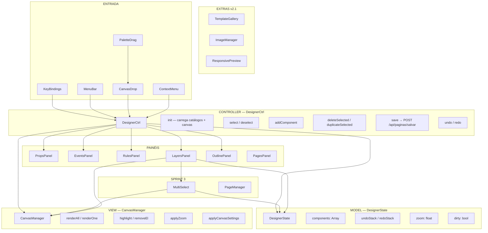
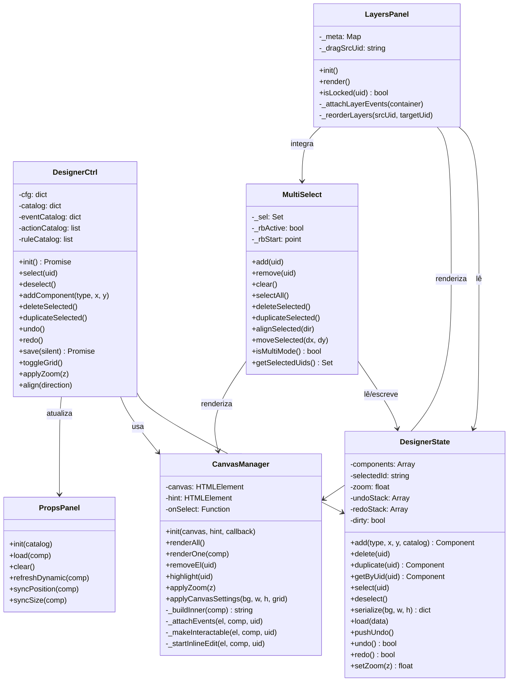
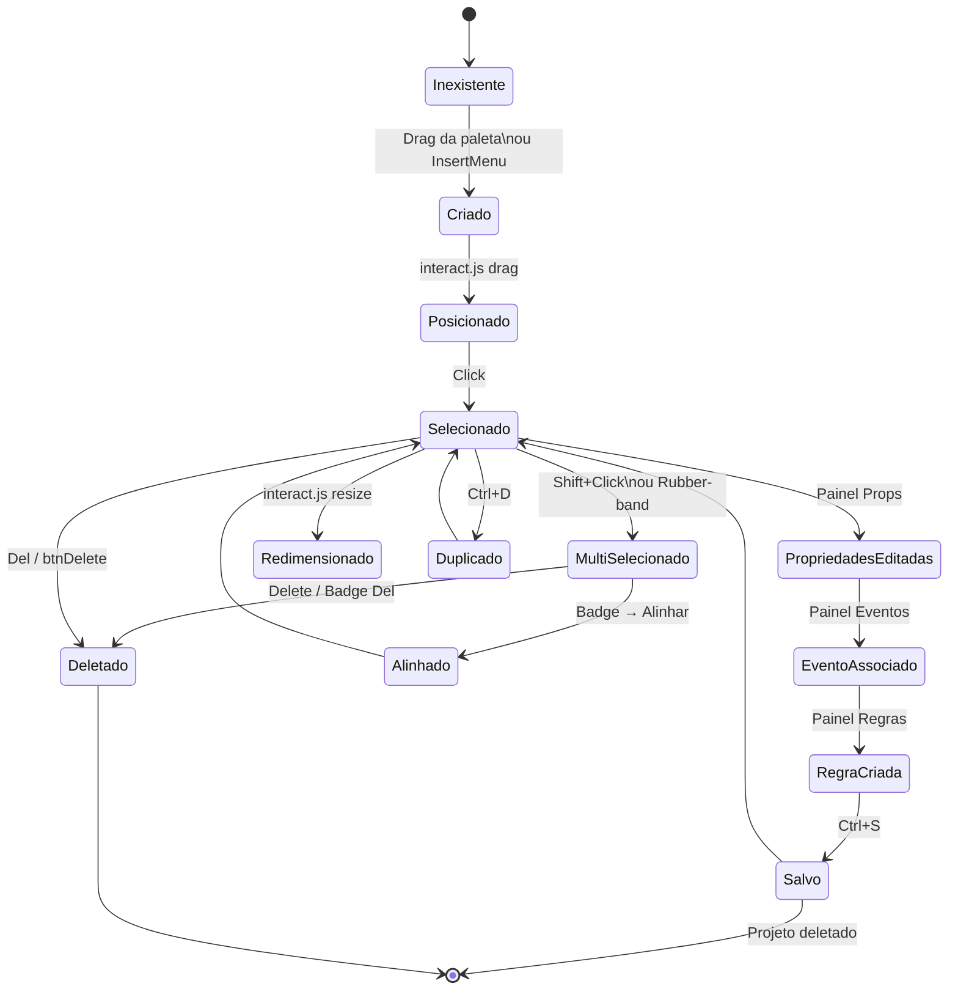
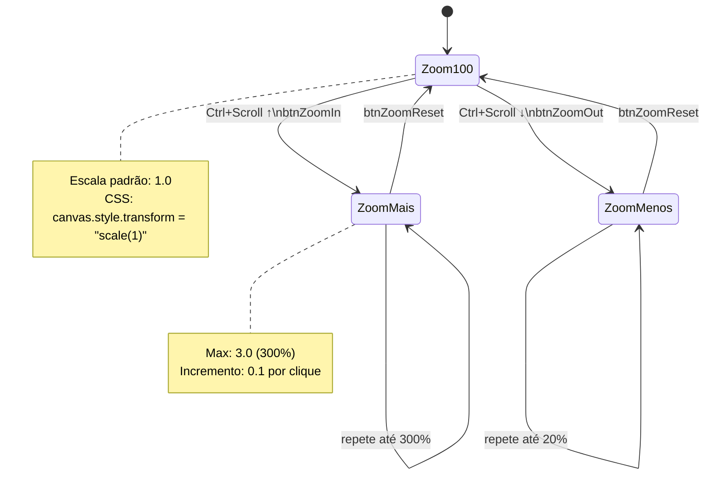
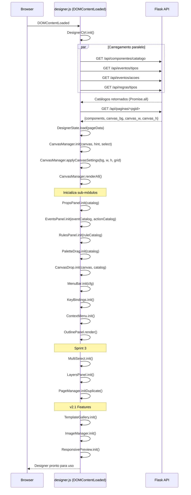
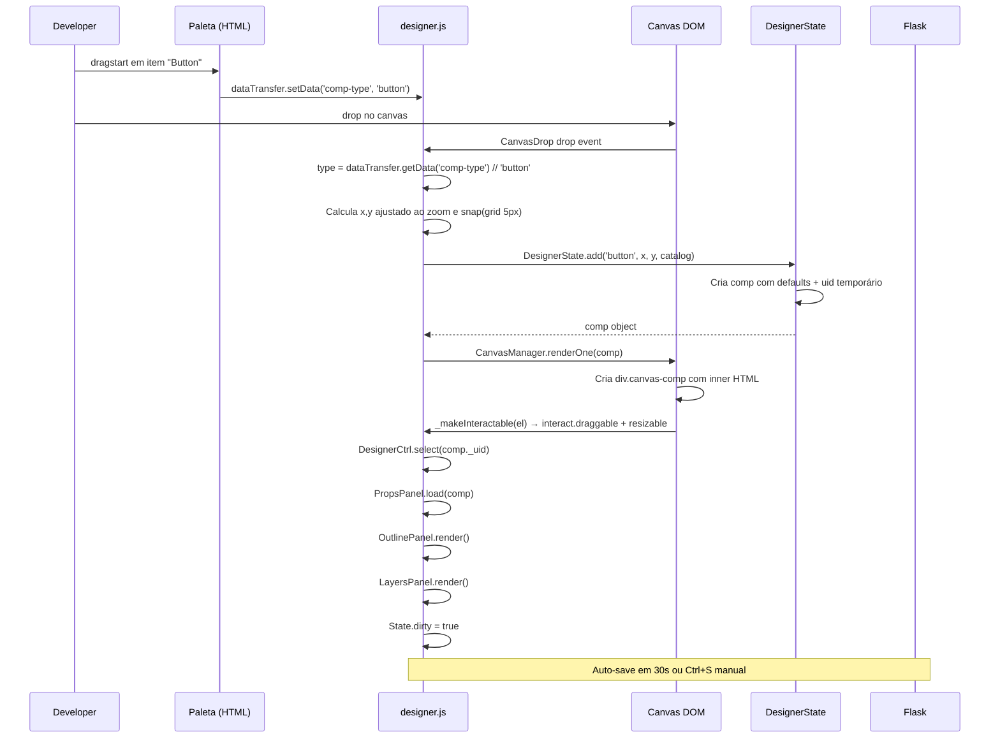

# 08 · Frontend — Designer Engine

> 📍 [Início](./README.md) › Frontend Designer

---

## 🏗️ Arquitetura Frontend (MVC)

O `designer.js` (~2.500 linhas) é organizado como **MVC no frontend** usando o padrão **Revealing Module** (IIFEs). Cada módulo é isolado e expõe apenas uma API pública.

---

## 📐 Class Diagram — Módulos JS

---

## 🔄 State Diagram — Ciclo de Vida de um Componente

---

## 🔄 State Diagram — Canvas Zoom

---

## 🔄 Sequence Diagram — Inicialização do Designer

---

## 🔄 Sequence Diagram — Drag & Drop de Componente

---

## ⌨️ Atalhos de Teclado

| Atalho | Ação |
|--------|------|
| `Ctrl+S` | Salvar |
| `Ctrl+Z` | Desfazer |
| `Ctrl+Y` / `Ctrl+Shift+Z` | Refazer |
| `Ctrl+D` | Duplicar selecionado(s) |
| `Ctrl+A` | Selecionar todos |
| `Delete` / `Backspace` | Deletar selecionado(s) |
| `Escape` | Desselecionar / Limpar multi-seleção |
| `F5` | Abrir Preview Responsivo |
| `↑ ↓ ← →` | Mover componente 2px |
| `Shift + ↑↓←→` | Mover componente 10px |
| `Shift + Click` | Toggle na multi-seleção |

---

## 🔗 Navegação

| Anterior | Próximo |
|----------|---------|
| [← API & Endpoints](./07_api_endpoints.md) | [Fluxos de Uso →](./09_fluxos_usuario.md) |
