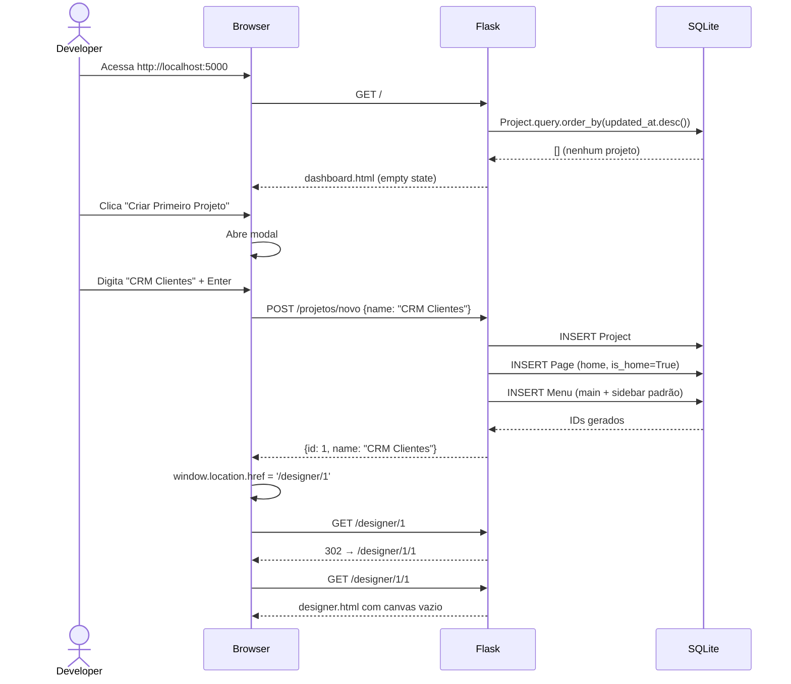
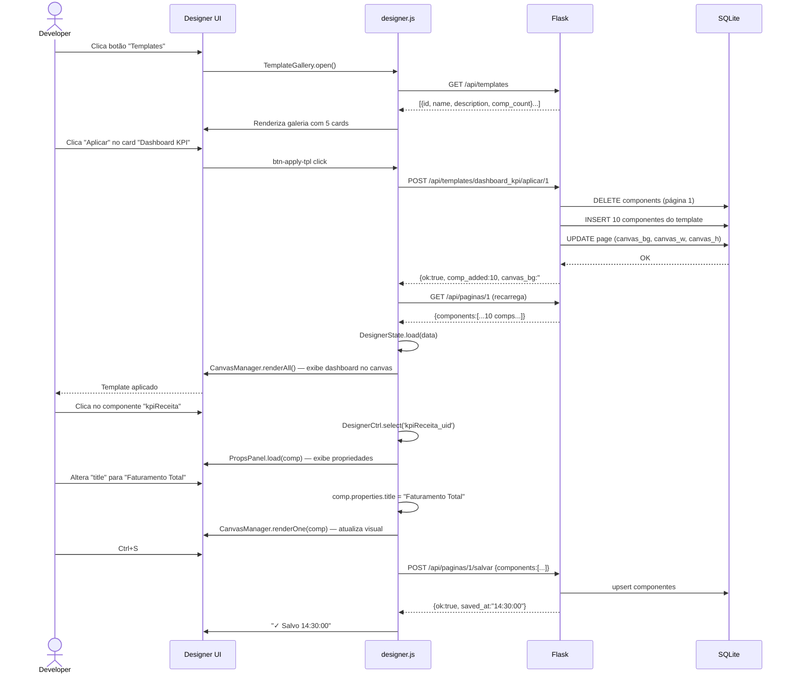
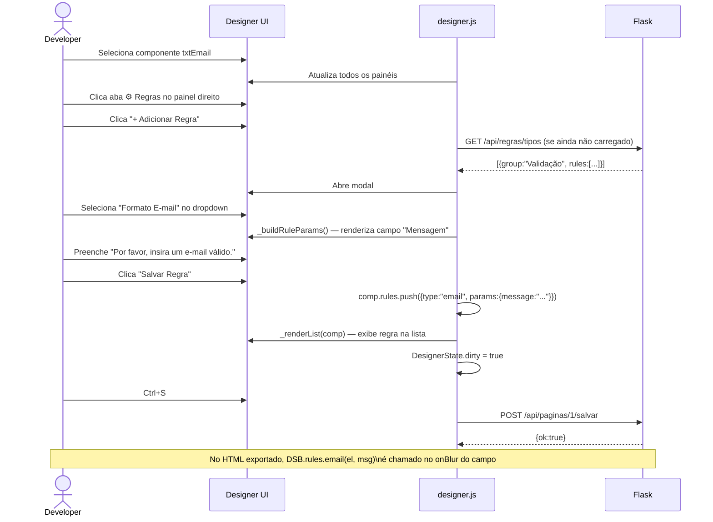
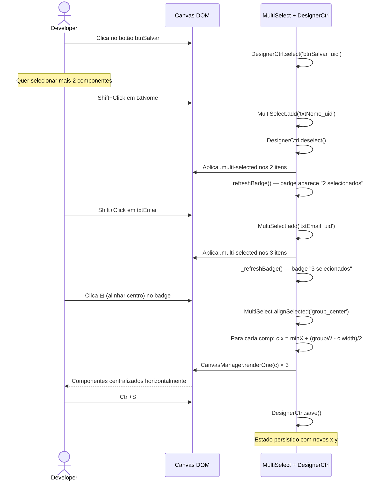
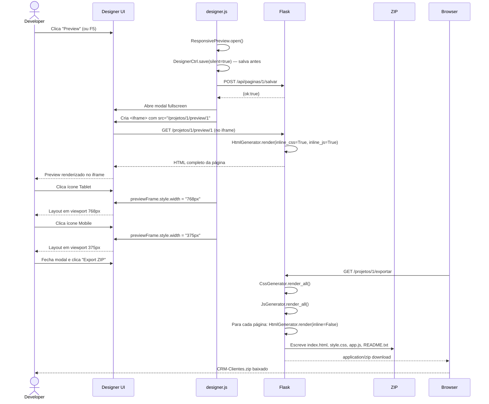
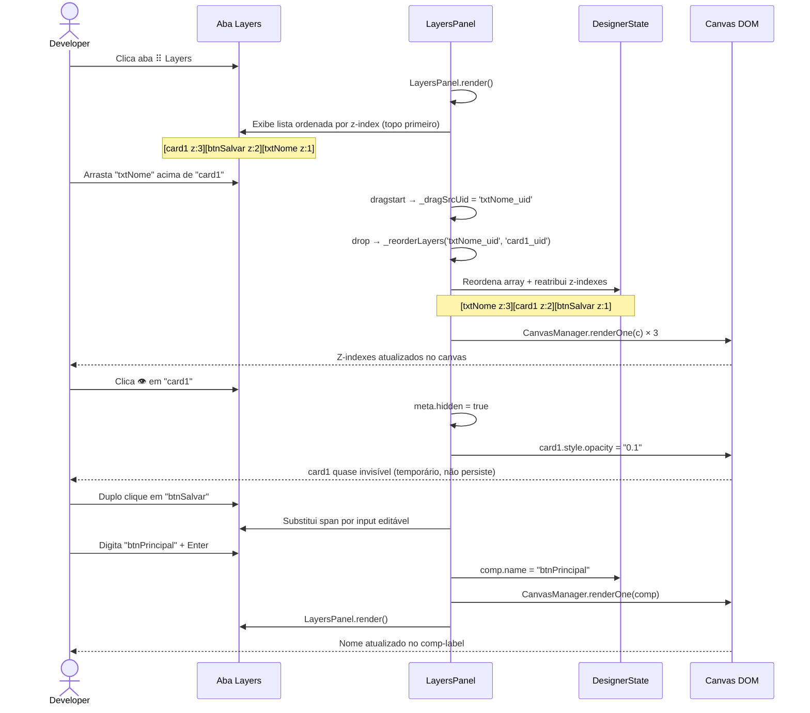
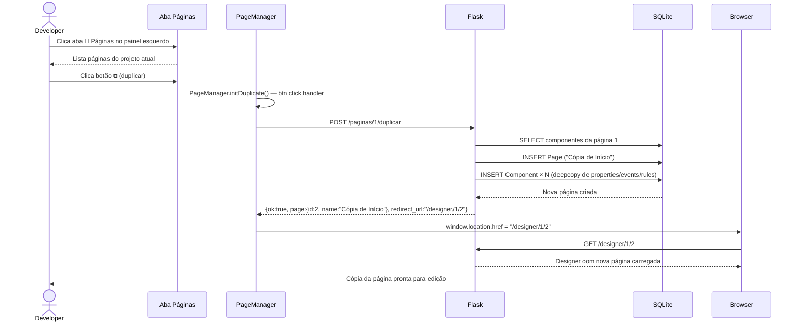

# 09 · Fluxos de Uso

> 📍 [Início](./README.md) › Fluxos de Uso

---

## 🔄 Fluxo 1 — Criar Projeto e Primeira Página

---

## 🔄 Fluxo 2 — Aplicar Template e Personalizar

---

## 🔄 Fluxo 3 — Adicionar Regra de Validação

---

## 🔄 Fluxo 4 — Multi-Seleção e Alinhamento

---

## 🔄 Fluxo 5 — Preview Responsivo e Export

---

## 🔄 Fluxo 6 — Layers Panel: Reordenar Z-Index

---

## 🔄 Fluxo 7 — Duplicar Página

---

## 🔗 Navegação

| Anterior | Próximo |
|----------|---------|
| [← Frontend Designer](./08_frontend_designer.md) | [Export & Preview →](./10_export_preview.md) |
