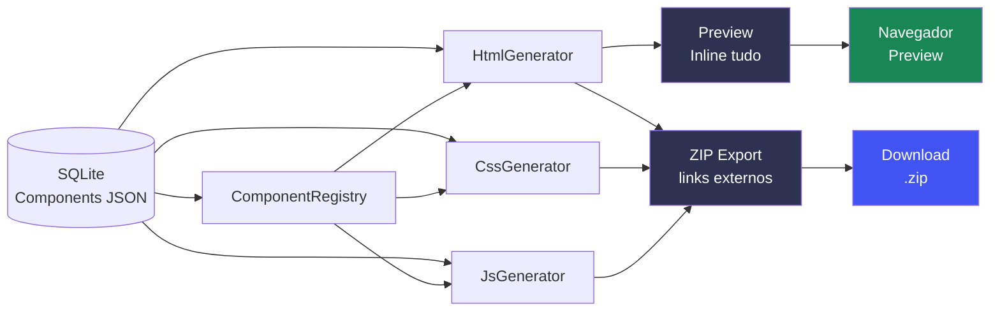
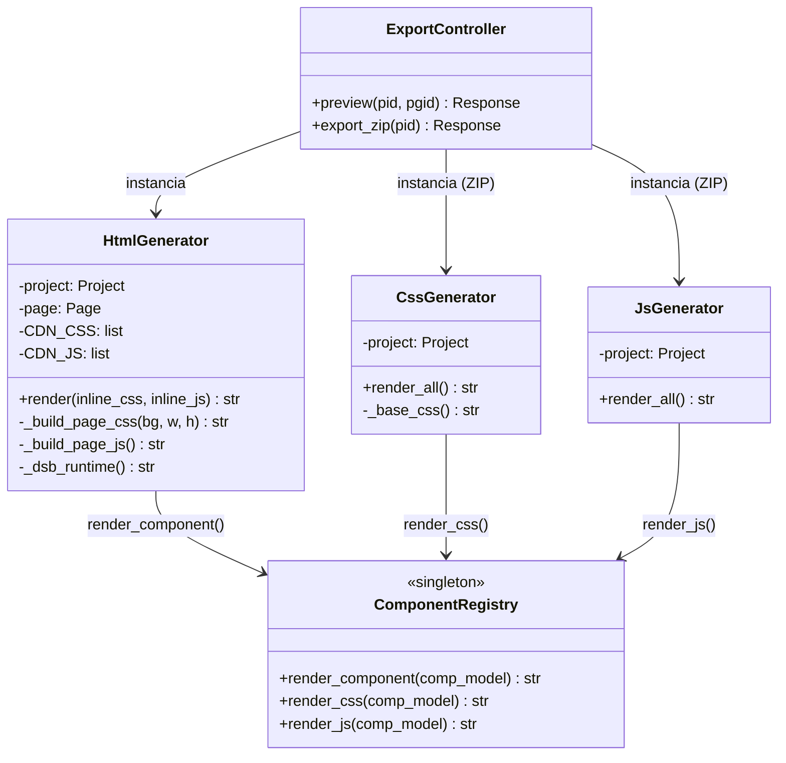
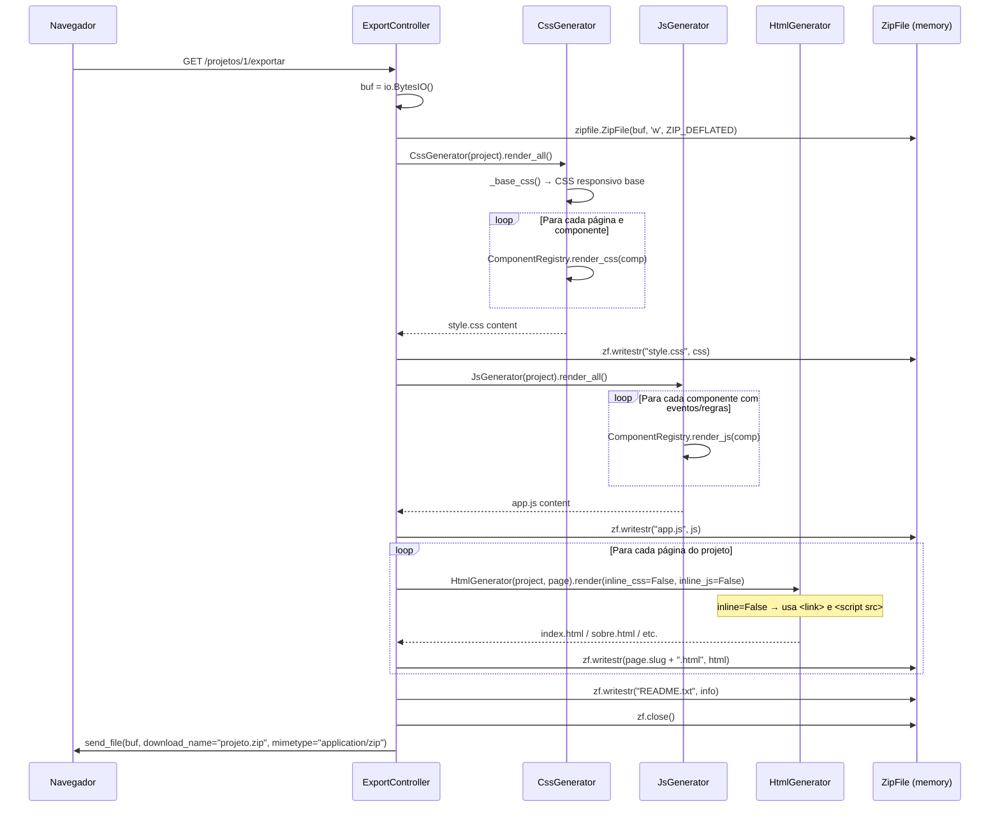
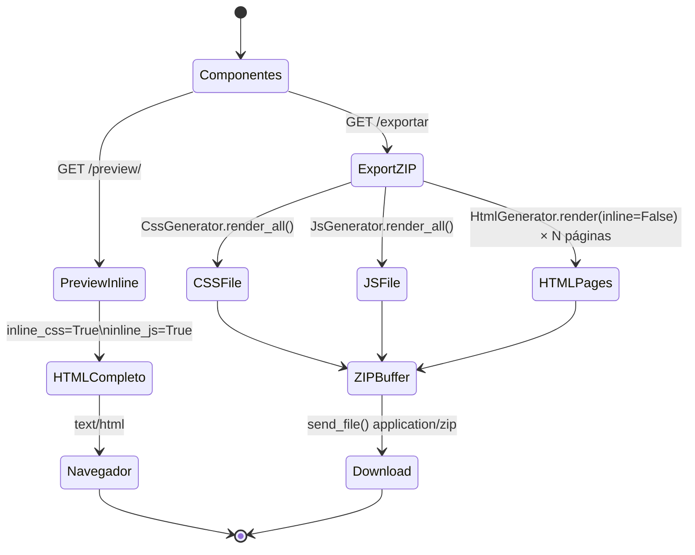

# 10 · Export & Preview — Pipeline de Geração de Código

> 📍 [Início](./README.md) › Export & Preview

---

## 🎯 Visão Geral

O pipeline de geração de código converte os dados persistidos no banco de dados em HTML, CSS e JavaScript funcionais, exportáveis como ZIP independente do builder.



---

## 🏗️ Class Diagram — Generators



---

## 🔄 Sequence Diagram — Preview Geração

```mermaid
sequenceDiagram
    participant B as Navegador
    participant EC as ExportController
    participant HG as HtmlGenerator
    participant CR as ComponentRegistry
    participant DB as SQLite

    B->>EC: GET /projetos/1/preview/1
    EC->>DB: Project.query.get(1)
    EC->>DB: Page.query.get(1)  ← inclui components
    DB-->>EC: Project + Page + Components
    EC->>HG: HtmlGenerator(project, page).render(inline_css=True, inline_js=True)

    HG->>HG: Resolve canvas_w, canvas_h, canvas_bg\n(page ou fallback project)
    HG->>HG: Ordena components por z_index

    loop Para cada Component
        HG->>CR: render_component(comp)
        CR->>CR: _REGISTRY.get(comp.type) → instância BaseComponent
        CR->>CR: instance.render_html(comp_id, name, props, x, y, w, h, z)
        CR-->>HG: HTML string do componente
    end

    HG->>HG: _build_page_css(bg, w, h)\n→ CSS base + CSS de cada comp
    HG->>HG: _build_page_js()\n→ JS de eventos e regras
    HG->>HG: _dsb_runtime()\n→ objeto DSB completo embutido
    HG->>HG: Monta documento HTML completo

    HG-->>EC: HTML string (15–50 KB)
    EC-->>B: text/html; charset=utf-8
```

---

## 🔄 Sequence Diagram — Export ZIP



---

## 📦 Estrutura do ZIP Exportado

```
meu-projeto.zip
├── index.html          ← Página home (is_home=True)
├── sobre.html          ← Demais páginas (slug como filename)
├── contato.html
├── style.css           ← CSS consolidado de todas as páginas
├── app.js              ← JS de eventos e regras de todas as páginas
└── README.txt          ← Metadados do projeto
```

---

## 📄 Estrutura do HTML Exportado

```html
<!DOCTYPE html>
<html lang="pt-BR">
<head>
  <meta charset="utf-8">
  <meta name="viewport" content="width=device-width, initial-scale=1">
  <title>Nome da Página</title>

  <!-- CDNs Bootstrap e Bootstrap Icons -->
  <link rel="stylesheet" href="https://cdn.jsdelivr.net/npm/bootstrap@5.3.3/...">
  <link rel="stylesheet" href="https://cdn.jsdelivr.net/npm/bootstrap-icons@1.11.3/...">

  <!-- Preview: CSS inline | Export: link externo -->
  <style>/* CSS gerado */</style>
  <!-- OU -->
  <link rel="stylesheet" href="style.css">
</head>
<body>
  <!-- Canvas com posicionamento absoluto -->
  <div id="dsb-canvas" class="dsb-canvas" style="background:#ffffff;">
    <!-- Componentes renderizados -->
    <div style="position:absolute;left:100px;top:50px;width:150px;min-height:40px;z-index:1;">
      <button id="comp_1" class="btn btn-primary" data-dsb="btnSalvar">Salvar</button>
    </div>
    <!-- ... mais componentes ... -->
  </div>

  <!-- CDNs JS -->
  <script src="https://cdn.jsdelivr.net/npm/bootstrap@5.3.3/.../bootstrap.bundle.min.js"></script>
  <script src="https://cdn.jsdelivr.net/npm/chart.js@4.4.0/..."></script>

  <!-- Runtime DSB (objeto completo embutido) -->
  <script>
    const DSB = {
      toast(msg, type, duration) { ... },
      val(id) { ... },
      setValue(id, v) { ... },
      // ... todos os métodos DSB
      rules: {
        required(el, msg) { ... },
        email(el, msg) { ... },
        // ...
      },
      initAll() { ... }
    };
  </script>

  <!-- Preview: JS inline | Export: script externo -->
  <script>
    document.addEventListener('DOMContentLoaded', () => {
      // eventos e regras dos componentes
      document.getElementById("comp_1").addEventListener("click", function(e) {
        DSB.toast('Salvo!', 'success');
      });
      DSB.initAll();
    });
  </script>
  <!-- OU -->
  <script src="app.js"></script>
</body>
</html>
```

---

## 📱 CSS Responsivo Gerado

O CSS gerado inclui automaticamente media queries para adaptar o layout absoluto ao mobile:

```css
/* Canvas com tamanho fixo no desktop */
.dsb-canvas {
  position: relative;
  width: 1280px;
  min-height: 900px;
  background: #ffffff;
  margin: 0 auto;
  box-shadow: 0 2px 20px rgba(0,0,0,.1);
  overflow: hidden;
}

/* Responsividade automática: abaixo da largura do canvas, 
   converte posicionamento absoluto em fluxo normal */
@media (max-width: 1280px) {
  .dsb-canvas {
    width: 100%;
    min-height: auto;
  }
  [style*="position:absolute"] {
    position: relative !important;
    left: auto !important;
    top: auto !important;
    width: 100% !important;
    margin-bottom: 8px;
  }
}
```

> **Nota:** A responsividade automática garante que o site funcione em mobile mesmo que a página tenha sido projetada em 1280px. O layout muda de **absoluto** para **fluxo normal** abaixo do breakpoint.

---

## 🔄 State Diagram — Modos de Exportação



---

## 🔗 Navegação

| Anterior | Próximo |
|----------|---------|
| [← Fluxos de Uso](./09_fluxos_usuario.md) | [Templates →](./11_templates.md) |
