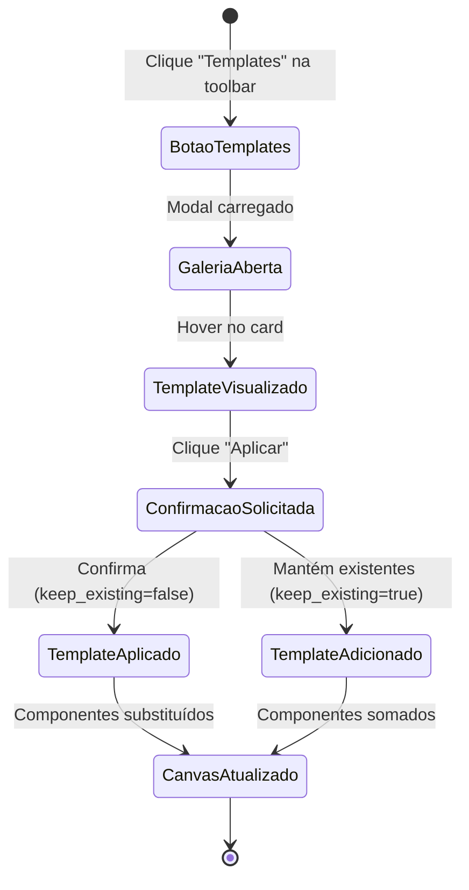
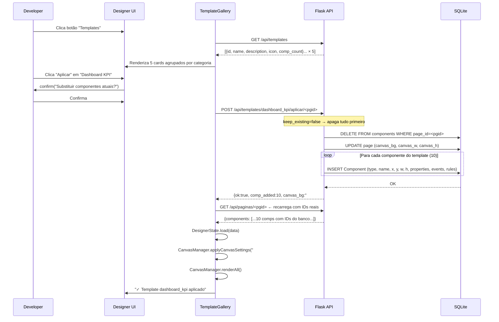

# 11 · Galeria de Templates

> 📍 [Início](./README.md) › Templates

---

## 🎯 Visão Geral

Templates são **páginas pré-montadas** com componentes, propriedades, eventos e regras já configurados. Ao aplicar um template, o usuário tem um ponto de partida profissional que pode personalizar.



---

## 📋 Templates Disponíveis

### 🔐 `login_form` — Formulário de Login
**Categoria:** Formulário | **Componentes:** 7 | **Canvas:** 1280×900 `#f0f4ff`

**Componentes:**
| Nome | Tipo | Função |
|------|------|--------|
| `cardLogin` | card | Container centralizado |
| `lblBemVindo` | heading | Título "Bem-vindo!" |
| `txtEmail` | textbox | Campo e-mail (type=email) |
| `txtSenha` | textbox | Campo senha (type=password) |
| `chkLembrar` | checkbox | "Lembrar acesso" |
| `btnEntrar` | button | Botão primário com toast |
| `lnkEsqueci` | label | "Esqueci minha senha" |

**Evento configurado:** `btnEntrar.onClick` → `DSB.toast('Verificando credenciais...', 'info')`

---

### 📊 `dashboard_kpi` — Dashboard KPI
**Categoria:** Dashboard | **Componentes:** 10 | **Canvas:** 1280×900 `#f6f9ff`

**Componentes:**
| Nome | Tipo | Função |
|------|------|--------|
| `lblTitulo` | heading | "Dashboard Analítico" |
| `kpiReceita` | card | KPI Receita Total (header azul) |
| `kpiClientes` | card | KPI Novos Clientes (header verde) |
| `kpiPedidos` | card | KPI Pedidos (header laranja) |
| `kpiSat` | card | KPI Satisfação (header vermelho) |
| `pbVendas` | progressbar | Meta mensal 72% |
| `lblMeta` | label | Texto da meta |
| `stAtual` | statusbar | Status do sistema |
| `chartVendas` | chart | Gráfico de barras mensais |
| `tblRecentes` | datagrid | Tabela de pedidos recentes |

---

### 👤 `crm_form` — Formulário CRM
**Categoria:** Formulário | **Componentes:** 19 | **Canvas:** 1280×900 `#ffffff`

**Seções:**
1. **Dados Pessoais:** Nome, E-mail (regra email), CPF (regra cpf), Telefone, Data Nascimento, Status
2. **Endereço:** CEP, Logradouro, Número, Bairro, Cidade, Estado (combobox UF)
3. **Observações:** textarea
4. **Ações:** btnSalvar (validateAll + toast), btnLimpar, btnCancelar (history.back)
5. **StatusBar** com mensagem de estado

**Regras configuradas:** `obrigatorio` no Nome, `email` no E-mail, `cpf` no CPF

---

### 🚀 `landing_page` — Landing Page
**Categoria:** Marketing | **Componentes:** 11 | **Canvas:** 1280×900 `#ffffff`

**Seções:**
1. **Navbar** com brand e links de navegação
2. **Hero Section:** Heading h1, subtítulo, CTA principal, botão Demo, imagem placeholder
3. **Separador**
4. **Benefícios:** Heading + 3 cards coloridos (azul/verde/laranja)
5. **Alert CTA** de conversão

**Evento configurado:** `btnCTA.onClick` → `DSB.toast('Redirecionando para cadastro...', 'info')`

---

### 📋 `relatorio_status` — Relatório de Status
**Categoria:** Relatório | **Componentes:** 15 | **Canvas:** 1280×900 `#f6f9ff`

**Componentes:**
| Nome | Tipo | Função |
|------|------|--------|
| `fases` | stepper | 5 fases do projeto (atual: Testes) |
| `pbBack/Front/Testes/Docs` | progressbar | Progresso por área (85/68/42/25%) |
| `tblTarefas` | datagrid | Tabela de tarefas com status emoji |
| `alrtAtencao` | alert | Aviso de prazo |
| `alrtSucesso` | alert | Notificação de sucesso |
| `tmrRefresh` | timer | Auto-refresh (desabilitado por padrão) |
| `stConexao` | statusbar | Status de conexão |
| `tabVisao` | tabs | Por Sprint / Área / Responsável |

---

## 🔄 Sequence Diagram — Aplicação de Template



---

## 🛠️ Como Adicionar um Novo Template

**Arquivo:** `controllers/template_controller.py`  
**Variável:** `TEMPLATE_CATALOG` (lista de dicionários)

```python
TEMPLATE_CATALOG = [
    # ... templates existentes ...
    {
        "id":          "meu_template",          # ID único snake_case
        "name":        "Meu Template",           # Nome exibido na galeria
        "description": "Descrição do template.", # Texto descritivo
        "icon":        "bi-grid",                # Bootstrap Icon
        "category":    "Minha Categoria",        # Agrupamento na galeria
        "canvas_bg":   "#ffffff",                # Cor do canvas
        "canvas_w":    1280,                     # Largura
        "canvas_h":    900,                      # Altura
        "components": [
            # Cada item segue o schema do model Component:
            {
                "type":       "button",
                "name":       "btnAcao",
                "x": 100, "y": 50,
                "width": 150, "height": 40,
                "z_index": 1,
                "properties": { "text": "Clique aqui", "variant": "primary" },
                "events":     { "onClick": "DSB.toast('Olá!', 'success');" },
                "rules":      []
            },
            # ... mais componentes ...
        ]
    }
]
```

> **Sem reinício necessário.** A adição do template ao catálogo é automaticamente servida pelo endpoint `GET /api/templates` — nenhuma outra mudança de código é necessária.

---

## 📐 Diagrama ER — Templates vs Componentes

```mermaid
erDiagram
    TEMPLATE_CATALOG {
        str  id          PK
        str  name
        str  description
        str  icon
        str  category
        str  canvas_bg
        int  canvas_w
        int  canvas_h
        list components
    }

    COMPONENT_SPEC {
        str  type
        str  name
        int  x
        int  y
        int  width
        int  height
        int  z_index
        dict properties
        dict events
        list rules
    }

    Page {
        int  id          PK
        int  project_id
        str  name
        str  canvas_bg
        int  canvas_w
        int  canvas_h
    }

    Component {
        int  id          PK
        int  page_id     FK
        str  type
        str  name
    }

    TEMPLATE_CATALOG ||--o{ COMPONENT_SPEC : "define"
    COMPONENT_SPEC   ..>  Component : "instanciado como"
    Page             ||--o{ Component : "possui após aplicação"
```

---

## 🔗 Navegação

| Anterior | Próximo |
|----------|---------|
| [← Export & Preview](./10_export_preview.md) | [Guia de Desenvolvimento →](./12_guia_desenvolvimento.md) |
