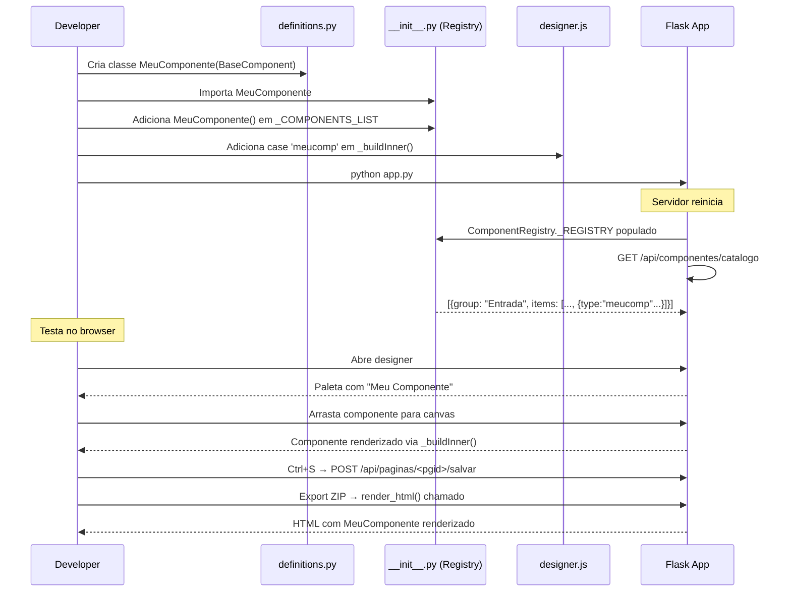

# 12 · Guia de Desenvolvimento

> 📍 [Início](./README.md) › Guia de Desenvolvimento

---

## 🎯 Princípios de Design

| Princípio | Aplicação no Projeto |
|-----------|---------------------|
| **MVC estrito** | Models em `models/`, Controllers em `controllers/`, Views em `views/` |
| **Open/Closed** | Novos componentes via subclasse — nunca edita código existente |
| **Reaproveitamento** | `BaseComponent` abstrato garante interface uniforme |
| **Zero dependência de CDN no core** | Vendors locais em `static/assets/vendor/` |
| **JSON como lingua franca** | `properties`, `events`, `rules` sempre como JSON no banco |
| **Definição de Pronto** | Toda feature precisa de teste funcional antes de ser entregue |

---

## ➕ Como Adicionar um Novo Componente

### Passo 1 — Criar a classe em `components/definitions.py`

```python
class MeuComponente(BaseComponent):
    """
    MeuComponente — breve descrição do propósito.
    Grupo: Entrada | Visualização | Container | Dados | Feedback | Navegação | Tempo
    """

    # ── Identidade ────────────────────────────────────────────
    type  = "meucomp"          # snake_case, único no sistema
    label = "Meu Componente"   # exibido na paleta
    icon  = "bi-puzzle"        # classe Bootstrap Icon
    group = "Entrada"          # grupo na paleta

    # ── Propriedades padrão ───────────────────────────────────
    @property
    def default_properties(self) -> dict:
        return {
            "text":        "Texto padrão",
            "font_size":   14,
            "text_color":  "#333333",
            "bg_color":    "#ffffff",
            "border_radius": 4,
            # Adicione todas as propriedades configuráveis
        }

    # ── Tamanho padrão ao soltar no canvas ────────────────────
    @property
    def default_size(self) -> dict:
        return {"width": 200, "height": 48}

    # ── Eventos disponíveis ───────────────────────────────────
    @property
    def available_events(self) -> list:
        return ["onClick", "onChange"]  # use nomes do EVENT_CATALOG

    # ── Regras aplicáveis ─────────────────────────────────────
    @property
    def available_rules(self) -> list:
        return ["obrigatorio", "visivel_se", "habilitado_se"]

    # ── Geração de HTML para export ───────────────────────────
    def render_html(self, comp_id, name, props, x, y, width, height, z_index) -> str:
        pos = self.position_style(x, y, width, height, z_index)
        text = props.get("text", "Texto")
        fs   = props.get("font_size", 14)
        fg   = props.get("text_color", "#333")
        bg   = props.get("bg_color", "#fff")
        br   = props.get("border_radius", 4)

        return (
            f'<div id="{comp_id}" style="{pos};background:{bg};color:{fg};'
            f'font-size:{fs}px;border-radius:{br}px;padding:8px 12px;" '
            f'data-dsb="{name}">{text}</div>'
        )

    # ── CSS customizado (opcional) ────────────────────────────
    def render_css(self, comp_id, props) -> str:
        # Retorne "" se usar apenas Bootstrap/inline
        return f"#{comp_id} {{ transition: all .2s; }}"
```

### Passo 2 — Registrar em `components/__init__.py`

```python
# Importar a classe
from .definitions import (
    # ... imports existentes ...
    MeuComponente,        # ← adicionar aqui
)

# Adicionar à lista de instâncias (mantém a ordem dos grupos)
_COMPONENTS_LIST = [
    # ... existentes ...
    MeuComponente(),      # ← adicionar no grupo correto
]
```

### Passo 3 — Adicionar preview no canvas (`static/js/designer.js`)

Dentro do método `CanvasManager._buildInner()`, adicione um `case`:

```javascript
case 'meucomp':
    return `<div style="padding:8px 12px;background:${p.bg_color||'#fff'};
                color:${p.text_color||'#333'};font-size:${p.font_size||14}px;
                border-radius:${p.border_radius||4}px;">${p.text||'Texto'}</div>`;
```

### Passo 4 — Propriedades dinâmicas no painel (opcional)

Se o componente tiver propriedades especiais, adicione no método `PropsPanel.refreshDynamic()`:

```javascript
if (comp.type === 'meucomp') {
    fields.push({key:'text',       label:'Texto',       type:'text'});
    fields.push({key:'font_size',  label:'Fonte (px)',  type:'number'});
    fields.push({key:'bg_color',   label:'Cor de Fundo',type:'color'});
}
```

### ✅ Checklist de novo componente

- [ ] Classe em `definitions.py` com todos os métodos obrigatórios
- [ ] Instância adicionada em `_COMPONENTS_LIST` (ordem correta do grupo)
- [ ] `case` adicionado em `CanvasManager._buildInner()` no JS
- [ ] Propriedades dinâmicas em `PropsPanel.refreshDynamic()` (se necessário)
- [ ] Testado: arrastar da paleta, selecionar, editar propriedades, preview, export

---

## ➕ Como Adicionar um Novo Controller

### Passo 1 — Criar `controllers/meu_controller.py`

```python
"""
controllers/meu_controller.py — Descrição do Controller
=========================================================
Responsável por:
  GET  /meu/recurso          → listagem
  POST /meu/recurso          → criar
  POST /meu/recurso/<id>     → atualizar
"""

from flask import Blueprint, jsonify, request
from models import db

bp = Blueprint("meu_recurso", __name__)


@bp.route("/meu/recurso")
def listar():
    """Retorna todos os recursos."""
    return jsonify({"ok": True, "items": []})


@bp.route("/meu/recurso", methods=["POST"])
def criar():
    """Cria um novo recurso."""
    data = request.get_json(force=True) or {}
    # ... lógica ...
    return jsonify({"ok": True})
```

### Passo 2 — Registrar em `controllers/__init__.py`

```python
def register_blueprints(app: Flask) -> None:
    # ... imports existentes ...
    from .meu_controller import bp as meu_bp   # ← adicionar

    # ... registros existentes ...
    app.register_blueprint(meu_bp)              # ← adicionar
```

---

## ➕ Como Adicionar um Novo Tipo de Regra

**Arquivo:** `rules/rule_types.py`

```python
# Dentro do grupo adequado em RULE_CATALOG:
{
    "id":       "minha_regra",
    "label":    "Minha Regra",
    "icon":     "bi-stars",
    "params":   [
        {"name": "param1", "label": "Rótulo", "type": "text",   "default": ""},
        {"name": "param2", "label": "Número", "type": "number", "default": "0"},
    ],
    "js_check": "DSB.rules.minhaRegra(el, '{param1}', {param2})",
    "description": "Descrição curta da regra."
}
```

**Arquivo:** `generators/html_generator.py` — método `_dsb_runtime()`:

```javascript
// Dentro do objeto DSB.rules:
minhaRegra(el, param1, param2) {
    // Implementação em JavaScript
    const valor = el.value;
    if (/* condição de falha */) {
        DSB.rules._err(el, `Mensagem de erro: ${param1}`);
        return false;
    }
    DSB.rules._ok(el);
    return true;
},
```

---

## ➕ Como Adicionar uma Nova Ação de Evento

**Arquivo:** `events/event_actions.py`

```python
# Dentro do grupo adequado em ACTION_CATALOG:
{
    "id":       "minha_acao",
    "label":    "Minha Ação",
    "params":   [
        {"name": "id",    "label": "ID do Componente", "type": "text", "default": "comp_1"},
        {"name": "valor", "label": "Valor",             "type": "text", "default": ""},
    ],
    "template": "DSB.minhaFuncao('{id}', '{valor}');"
}
```

Se a ação requer uma função no runtime, adicione em `_dsb_runtime()`:

```javascript
// No objeto DSB:
minhaFuncao(id, valor) {
    const el = document.getElementById(id);
    if (!el) return;
    // ... implementação ...
},
```

---

## ➕ Como Adicionar um Novo Template

**Arquivo:** `controllers/template_controller.py`

```python
TEMPLATE_CATALOG = [
    # ... existentes ...
    {
        "id":          "meu_template",
        "name":        "Meu Template",
        "description": "Descrição do template.",
        "icon":        "bi-grid",
        "category":    "Minha Categoria",
        "canvas_bg":   "#ffffff",
        "canvas_w":    1280,
        "canvas_h":    900,
        "components": [
            {
                "type": "heading", "name": "lblTitulo",
                "x": 40, "y": 20, "width": 400, "height": 48,
                "z_index": 1,
                "properties": {"text": "Meu Template", "tag": "h2", "font_size": 24},
                "events": {}, "rules": []
            },
            # ... mais componentes ...
        ]
    }
]
```

---

## 🔧 Configuração do Ambiente de Desenvolvimento

```bash
# 1. Clonar repositório
git clone https://github.com/ChristopherNicolasSMM/DEVStationFlask.git
cd DEVStationFlask

# 2. Criar e ativar ambiente virtual
python -m venv .venv
# Windows:
.venv\Scripts\activate
# Linux/Mac:
source .venv/bin/activate

# 3. Instalar dependências
pip install -r requirements.txt

# 4. Executar em modo debug
python app.py
# → http://localhost:5000

# 5. Executar testes (quando existirem)
pytest tests/ -v
```

---

## 🧪 Teste Manual de Funcionalidade

Exemplo de teste via `app.test_client()`:

```python
from app import create_app
import json

app = create_app()

with app.app_context():
    from models import db
    db.drop_all()
    db.create_all()

with app.test_client() as c:
    # Criar projeto
    r = c.post('/projetos/novo', data={'name': 'Teste'})
    pid = json.loads(r.data)['id']
    pgid = json.loads(c.get(f'/projetos/{pid}/info').data)['pages'][0]['id']

    # Aplicar template
    c.post(f'/api/templates/login_form/aplicar/{pgid}',
           data=json.dumps({'keep_existing': False}),
           content_type='application/json')

    # Verificar preview
    r = c.get(f'/projetos/{pid}/preview/{pgid}')
    assert r.status_code == 200
    assert 'Bem-vindo' in r.data.decode()

    # Verificar export
    r = c.get(f'/projetos/{pid}/exportar')
    assert r.status_code == 200
    assert r.content_type == 'application/zip'
```

---

## 📐 Diagrama de Fluxo — Adição de Componente



---

## 🏗️ Padrões de Nomenclatura

| Contexto | Padrão | Exemplo |
|----------|--------|---------|
| Tipo de componente | `snake_case` | `datagrid`, `progressbar` |
| Nome de componente no canvas | `camelCase` | `btnSalvar`, `txtNome` |
| Blueprint (controller) | `snake_case` | `project_controller.py` |
| Nome do Blueprint | `snake_case` | `bp = Blueprint("project", ...)` |
| Endpoint URL | `kebab-case` | `/projetos/novo`, `/api/paginas/<pgid>/salvar` |
| Variáveis JS | `camelCase` | `DesignerState`, `_buildInner` |
| IDs CSS | `kebab-case` | `#dsb-header`, `.canvas-comp` |
| Classes CSS | `kebab-case` | `.proj-card`, `.layer-item` |

---

## 🔗 Navegação

| Anterior | Próximo |
|----------|---------|
| [← Templates](./11_templates.md) | [Histórico de Versões →](./13_sprint_history.md) |
