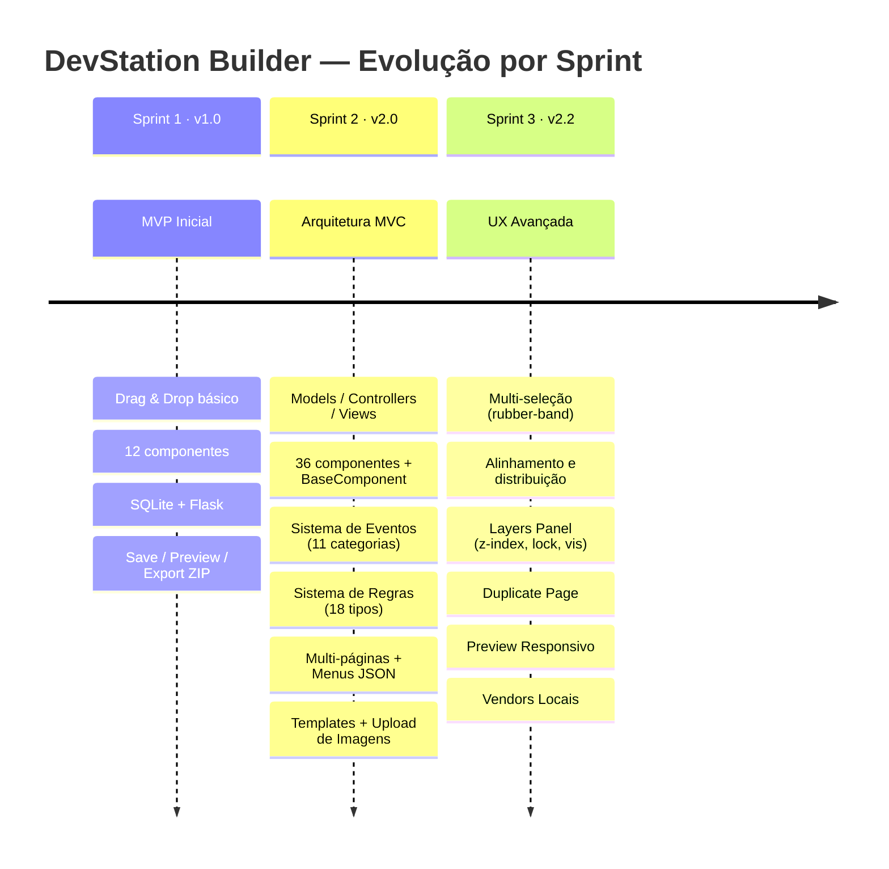
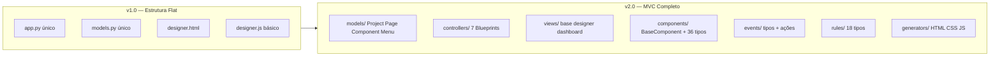

# 13 · Histórico de Versões

> 📍 [Início](./README.md) › Histórico de Versões

---

## 📊 Linha do Tempo

---

## 🏷️ v1.0 — Sprint 1: MVP

**Data:** Abril 2026  
**Entregável:** `devstation_builder_v1.0.zip`

### ✅ Funcionalidades Entregues

#### Canvas & UX
- Drag & drop da paleta para o canvas com posicionamento absoluto
- Redimensionamento por handles (interact.js)
- Snap em grid de 5px
- Zoom (Ctrl+Scroll + botões ±)
- Undo/Redo com 50 estados em stack
- Auto-save a cada 30 segundos
- Context menu (botão direito) com ações rápidas
- Duplo clique para editar texto inline
- Atalhos de teclado: Ctrl+S, Ctrl+Z, Ctrl+D, Del, setas

#### Componentes (12 tipos)
`button` · `label` · `input` · `textarea` · `image` · `card` · `divider` · `alert` · `badge` · `icon` · `container` · `heading`

#### Persistência
- SQLite com modelo flat (`Projeto` com `canvas_json` como texto)
- Save/Load via `POST /api/projeto/<pid>/salvar`

#### Export
- Preview em nova aba
- Export ZIP: `index.html` + `style.css`

---

### 🐛 Bugs Conhecidos Resolvidos na v1.0

| Bug | Causa | Solução |
|-----|-------|---------|
| `init_storage()` com scoping errado | Definida dentro de `create_app()` mas chamada externamente | Movida para escopo de módulo |
| `ui.menu_item()` com parâmetro `icon=` | API não suporta esse kwarg | Removido `icon=` |
| Estrutura ZIP duplicada (`pkg/pkg/`) | Path errado no zipfile | Corrigido para pasta única |

---

## 🏷️ v2.0 — Sprint 2: Arquitetura MVC

**Data:** Abril 2026  
**Entregável:** `devstation_builder_v2.0_mvc.zip`

### 🏗️ Reestruturação Completa

### ✅ Funcionalidades Entregues

#### Arquitetura
- Application Factory (`create_app()`)
- 7 Blueprints independentes (project, page, component, event, rule, export, menu)
- SQLAlchemy com 4 models relacionais (Project → Page → Component, Menu)
- `BaseComponent` abstrato + `ComponentRegistry` singleton

#### Componentes (36 tipos, 7 grupos)
- **Entrada:** button, textbox, textarea, numberbox, checkbox, radiobutton, combobox, switch, slider, datepicker, rating, fileupload
- **Visualização:** label, heading, image, icon, badge, progressbar, statusbar, separator, spinner
- **Container:** panel, card, groupbox, tabs, accordion
- **Dados:** datagrid, chart, pagination
- **Feedback:** alert, modal
- **Navegação:** navbar, breadcrumb, stepper
- **Tempo:** timer, countdown

#### Sistema de Eventos
- 11 categorias de eventos (universal, input, datagrid, timer, countdown, modal, tabs, accordion, form, scroll)
- ~50 tipos de eventos
- 23 ações pré-definidas (navegação, UI, valores, timer, API, validação, JS livre)
- Editor visual com modal de configuração
- Runtime DSB embutido no export

#### Sistema de Regras
- 18 tipos: 10 validação + 3 visibilidade + 5 cálculo
- Validação: obrigatorio, min/max_length, email, cpf, cnpj, numero, min/max_valor, data_valida
- Visibilidade: visivel_se, oculto_se, habilitado_se
- Cálculo: calcular, somar, progresso, status_map, formatar
- Editor visual com modal de parâmetros

#### Multi-páginas
- Múltiplas páginas por projeto
- Slug automático para export
- Navegação entre páginas no painel esquerdo

#### Menus Configuráveis
- Menu principal com 6 categorias (Arquivo, Editar, Visualizar, Inserir, Ferramentas, Ajuda)
- Sidebar configurável via JSON
- Renderização server-side via Jinja2

---

## 🏷️ v2.1 — Sprint 2.1: Features Avançadas

**Data:** Abril 2026  
**Entregável:** `devstation_builder_v2.1_mvc_features.zip`

### 🐛 Correções

| Bug | Causa | Solução |
|-----|-------|---------|
| Dashboard quebrado | `base.html` dependia 100% do NiceAdmin CSS | Reescrito como layout autossuficiente com CSS embutido |
| `menu.items` conflito Python | dict.items() sobrescrevia propriedade Jinja | Alterado para `menu.get('items', [])` |
| `group.items` conflito | Mesmo problema no loop da paleta | Alterado para `group['items']` |
| `NumberBox` KeyError | `props.get("min") != ""` vs `None` | Comparação alterada para `props.get("min", "") != ""` |

### ✅ Funcionalidades Entregues

#### Upload de Imagens (`upload_controller.py`)
- `POST /upload/imagem` — multipart, validação tipo/tamanho (5MB)
- `GET /upload/listar` — galeria com metadados
- `DELETE /upload/imagem/<filename>` — remoção com sanitização de path
- Armazenamento em `static/uploads/` com nomes UUID

#### Galeria de Templates (`template_controller.py`)
- 5 templates: Login, Dashboard KPI, CRM Form, Landing Page, Relatório
- `GET /api/templates` — listagem
- `POST /api/templates/<id>/aplicar/<pgid>` — aplica com opção keep_existing
- Componentes com propriedades, eventos e regras pré-configurados

#### Preview Responsivo (`ResponsivePreview` module)
- Modal fullscreen com iframe
- Toggle de viewport: Desktop (1280px) / Tablet (768px) / Mobile (375px)
- Auto-save antes de exibir
- Atalho F5

#### Modal de Gerenciamento de Imagens (`ImageManager` module)
- Upload drag & drop
- Galeria visual com miniaturas
- Seleção integrada ao painel de propriedades
- Botão delete por imagem

#### Vendors Locais
- `base.html` e `designer.html` apontam para `/static/assets/vendor/bootstrap/`
- Funciona offline sem CDN externo

---

## 🏷️ v2.2 — Sprint 3: Multi-Seleção & Layers

**Data:** Abril 2026  
**Entregável:** `devstation_builder_v2.2_sprint3.zip`

### ✅ Funcionalidades Entregues

#### Multi-Seleção (`MultiSelect` module, ~300 linhas JS)

| Feature | Descrição |
|---------|-----------|
| Shift+Click | Toggle de componente na seleção múltipla |
| Rubber-band | Arrasto no canvas vazio para selecionar por área |
| Ctrl+A | Selecionar todos os componentes |
| Escape | Limpar seleção múltipla |
| Ctrl+D (grupo) | Duplicar todos os selecionados |
| Delete (grupo) | Remover todos os selecionados |
| Setas (grupo) | Mover grupo 2px / Shift+setas 10px |
| Selection Badge | Barra flutuante com ações de alinhamento |

**7 modos de alinhamento:**
- Centralizar no canvas
- Alinhar ao grupo (esquerda, centro, direita, topo, fundo)
- Distribuição equidistante horizontal e vertical

#### Layers Panel (`LayersPanel` module, ~200 linhas JS)

| Feature | Descrição |
|---------|-----------|
| Lista ordenada | z-index decrescente (topo → fundo) |
| Drag para reordenar | Altera z-indexes automaticamente |
| Toggle visibilidade 👁️ | Oculta temporariamente no canvas |
| Toggle lock 🔒 | Bloqueia drag/resize, borda laranja |
| Rename inline | Duplo clique → input editável |
| Delete ✕ | Botão por linha |
| Highlight | Azul = seleção simples, Laranja = multi-seleção |

#### Duplicate Page (`PageManager` + endpoint)
- Botão ⧉ na aba Páginas do painel esquerdo
- `POST /paginas/<pgid>/duplicar` com deepcopy de properties/events/rules
- Nome automático: "Cópia de `<nome>`"
- Redirecionamento automático para a nova página

---

## 📊 Métricas por Sprint

| Métrica | v1.0 | v2.0 | v2.1 | v2.2 |
|---------|------|------|------|------|
| Componentes | 12 | 36 | 36 | 36 |
| Tipos de regras | 0 | 18 | 18 | 18 |
| Ações de eventos | 0 | 23 | 23 | 23 |
| Templates prontos | 0 | 0 | 5 | 5 |
| Módulos JS | ~4 | ~10 | 13 | 16 |
| Linhas JS | ~500 | ~1.200 | ~1.800 | ~2.500 |
| Linhas Python | ~300 | ~1.200 | ~1.600 | ~1.800 |
| Rotas HTTP | ~6 | ~22 | ~28 | ~30 |
| Tamanho ZIP | 20KB | 60KB | 96KB | 104KB |

---

## 🔗 Navegação

| Anterior | Próximo |
|----------|---------|
| [← Guia de Desenvolvimento](./12_guia_desenvolvimento.md) | [Roadmap & Backlog →](./14_roadmap.md) |
