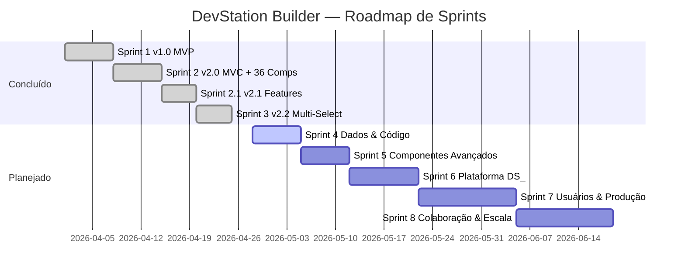
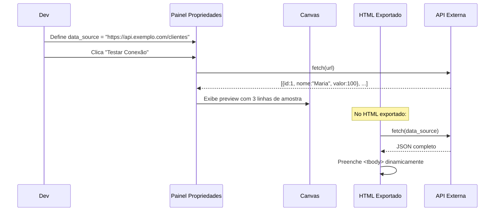
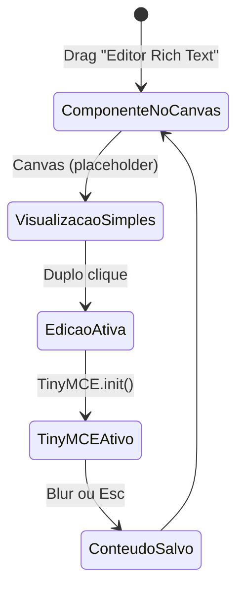
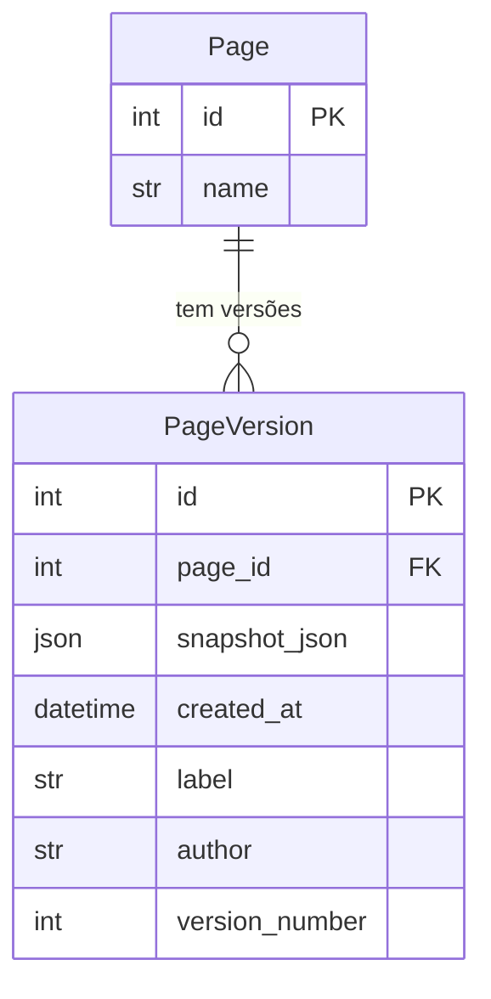
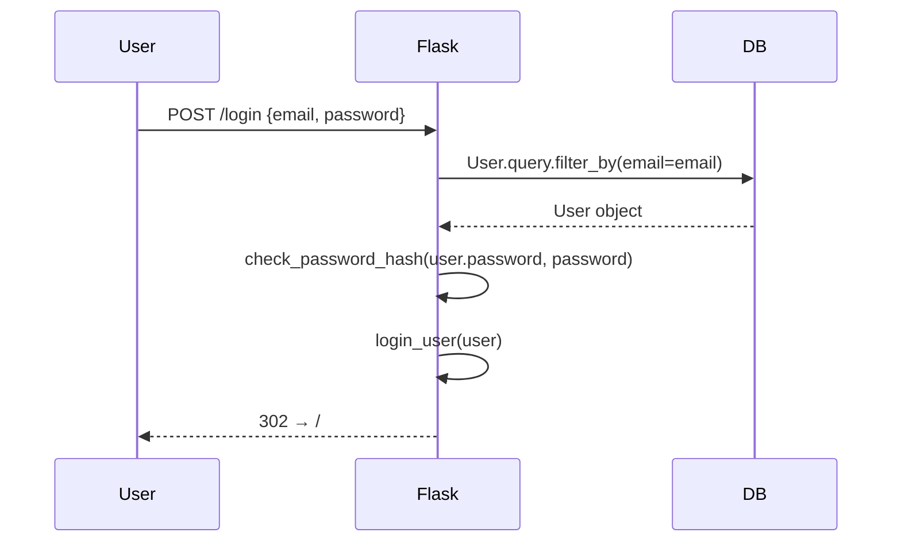
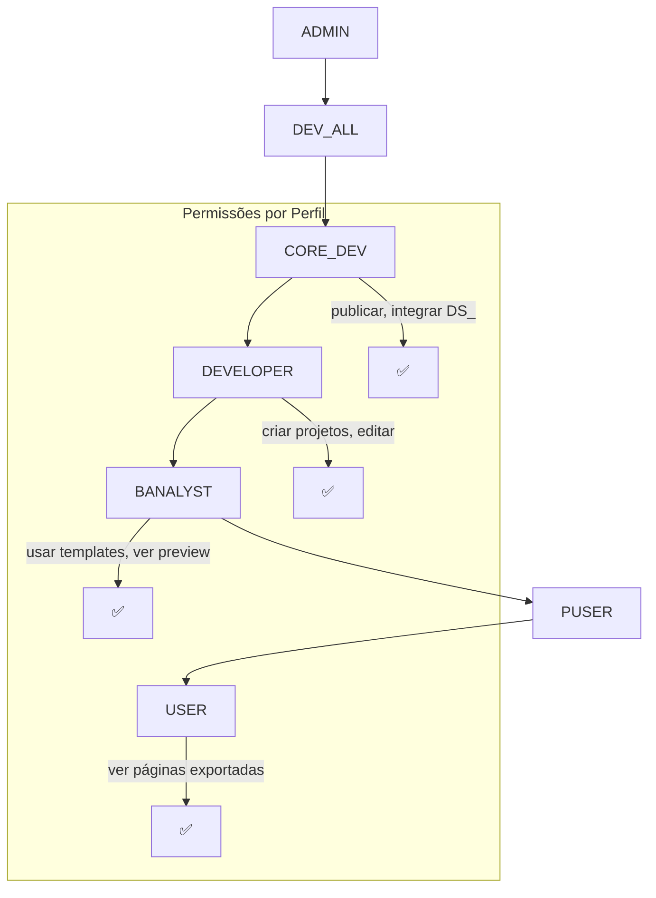

# 14 · Roadmap & Backlog

> 📍 [Início](./README.md) › Roadmap & Backlog

---

## 🗺️ Roadmap Visual



---

## 🏃 Sprint 4 — Dados & Código *(próxima)*

**Objetivo:** Conectar componentes a dados reais e expor o código gerado ao desenvolvedor.

---

### `S4-001` DataGrid com Fonte de API ⭐⭐⭐
**Prioridade:** Alta | **Esforço:** M



**Critérios de Aceite:**
- [ ] Propriedades no DataGrid: `data_source` (URL), `data_method`, `data_field`
- [ ] Botão "Testar" no painel — fetch + preview 3 linhas
- [ ] Export gera JS que faz fetch ao carregar a página
- [ ] Fallback para rows estáticas se API falhar
- [ ] Integração com Timer via regra `data_refresh`

---

### `S4-002` Modal "Ver Código Gerado" ⭐⭐⭐
**Prioridade:** Alta | **Esforço:** S

**Critérios de Aceite:**
- [ ] Botão `</>` na toolbar do designer
- [ ] Modal com abas: HTML · CSS · JavaScript
- [ ] Syntax highlight com `highlight.js` (CDN)
- [ ] Botão "Copiar" por aba
- [ ] Atualização ao abrir (sem salvar no banco)
- [ ] Contador de linhas no rodapé

---

### `S4-003` Snap to Components ⭐⭐
**Prioridade:** Média | **Esforço:** M

**Critérios de Aceite:**
- [ ] Guias azuis (1px) durante drag quando alinhado com outro componente
- [ ] Snap suave a ≤8px de distância
- [ ] Guias para: left/right/top/bottom/center-x/center-y
- [ ] Toggle na toolbar (ícone bússola)
- [ ] Não interfere com snap de grid

---

## 🟢 Sprint 5 — Componentes Avançados (Vendors Locais)

**Objetivo:** Aproveitar vendors já presentes no repositório.

---

### `S5-001` RichTextEditor (TinyMCE) ⭐⭐⭐
**Vendor:** `/static/assets/vendor/tinymce/` *(já presente)*



---

### `S5-002` ApexChart Avançado ⭐⭐⭐
**Vendor:** `/static/assets/vendor/apexcharts/` *(já presente)*

Tipos adicionais: `area`, `radialBar` (gauge), `heatmap`, `donut`, `candlestick`

---

### `S5-003` MaskedInput ⭐⭐
Máscaras: CPF (`000.000.000-00`), CNPJ (`00.000.000/0000-00`), Telefone (`(00) 00000-0000`), CEP (`00000-000`), Data (`00/00/0000`)

---

### `S5-004` TreeView ⭐⭐
Estrutura: `[{id, label, icon, children: [...], expanded: bool}]`  
Eventos: `onNodeClick`, `onNodeExpand`, `onNodeCollapse`

---

### `S5-005` Kanban Board ⭐
Colunas configuráveis com cards arrastáveis internamente.  
Evento: `onCardMove(cardId, fromCol, toCol)`

---

## 🟡 Sprint 6 — Plataforma DS_ & Versionamento

**Objetivo:** Integrar ao ecossistema DevStation e adicionar versionamento.

---

### `S6-001` Integração DS_DESIGNER ⭐⭐⭐

```mermaid
graph LR
    subgraph DevStation["DevStation Platform"]
        DS[DS_DESIGNER\nTransação Oficial]
        AUDIT[DS_AUDIT\nLog de Auditoria]
        RBAC[RBAC 7 Níveis]
    end

    subgraph Builder["DevStation Builder"]
        PROJ[Projeto Builder]
        PAGE[Página]
        COMP[Componente]
    end

    DS --> PROJ : acessa
    PROJ --> AUDIT : gera logs
    RBAC --> DS : controla acesso
    PROJ -.-> NDS[Transação NDS_* associada]
```

---

### `S6-002` Versões de Página ⭐⭐⭐



**Critérios de Aceite:**
- [ ] Model `PageVersion` (snapshot JSON, created_at, label, author)
- [ ] Snapshot automático a cada save (máx 10 por página, FIFO)
- [ ] Botão "Histórico" na toolbar
- [ ] Modal com lista de versões + diff visual (componentes adicionados/removidos)
- [ ] Botão "Restaurar" com undo antes de aplicar
- [ ] Tag manual de versão

---

### `S6-003` Export com Bootstrap Offline ⭐⭐
Checkbox no export → inclui `vendor/` no ZIP → site 100% offline.

---

### `S6-004` Importar Projeto de ZIP ⭐⭐
`POST /projetos/importar` → lê ZIP, cria projeto + páginas + componentes.

---

## 🔴 Sprint 7 — Usuários & Produção

**Objetivo:** Tornar o sistema multi-usuário e pronto para deploy.

---

### `S7-001` Autenticação (Flask-Login) 🔴



---

### `S7-002` RBAC (Perfis de Acesso)



---

### `S7-003` PostgreSQL + Alembic + Docker 🟠

```yaml
# docker-compose.yml (futuro)
services:
  web:
    build: .
    ports: ["5000:5000"]
    environment:
      - DATABASE_URL=postgresql://user:pass@db/devstation
  db:
    image: postgres:16
    volumes: [postgres_data:/var/lib/postgresql/data]
```

---

## 🟢 Sprint 8 — Colaboração & Escala

### `S8-001` Compartilhamento de Projetos
Model `ProjectShare` (project_id, user_id, permission: view/edit/admin)

### `S8-002` API Pública (OpenAPI/Swagger)
Autenticação via `X-API-Key`, rate limiting, documentação `/api/docs`

### `S8-003` CI/CD (GitHub Actions)
```yaml
# .github/workflows/test.yml
on: [push]
jobs:
  test:
    runs-on: ubuntu-latest
    steps:
      - uses: actions/checkout@v4
      - run: pip install -r requirements.txt
      - run: pytest tests/ -v
```

---

## 📋 Backlog Completo por Épico

### Legenda
| Símbolo | Significado |
|---------|-------------|
| ✅ | Concluído |
| 🔄 | Em andamento |
| ⏳ | Planejado |
| 💡 | Ideia / Nice-to-have |

---

### ÉPICO 1 — Canvas & UX

| ID | Item | Sprint | Status |
|----|------|--------|--------|
| E1-01 | Drag & drop básico + snap grid | 1 | ✅ |
| E1-02 | Resize (interact.js) | 1 | ✅ |
| E1-03 | Zoom (Ctrl+Scroll) | 1 | ✅ |
| E1-04 | Undo / Redo 50 estados | 1 | ✅ |
| E1-05 | Auto-save 30s | 1 | ✅ |
| E1-06 | Context menu | 1 | ✅ |
| E1-07 | Inline text edit (duplo clique) | 1 | ✅ |
| E1-08 | Atalhos teclado | 1 | ✅ |
| E1-09 | Multi-seleção rubber-band | 3 | ✅ |
| E1-10 | Alinhamento e distribuição | 3 | ✅ |
| E1-11 | Layers Panel | 3 | ✅ |
| E1-12 | Snap to Components (guias) | 4 | ⏳ |
| E1-13 | Lock aspect ratio no resize | 4 | ⏳ |
| E1-14 | Copiar/colar (Ctrl+C/V) | 4 | ⏳ |
| E1-15 | Régua/grid visual no canvas | 5 | ⏳ |
| E1-16 | Mini-mapa do canvas | 8 | 💡 |

---

### ÉPICO 2 — Componentes

| ID | Item | Sprint | Status |
|----|------|--------|--------|
| E2-01 | 36 componentes (7 grupos) | 2 | ✅ |
| E2-02 | RichTextEditor (TinyMCE) | 5 | ⏳ |
| E2-03 | ApexChart avançado | 5 | ⏳ |
| E2-04 | MaskedInput (CPF/CNPJ/Tel) | 5 | ⏳ |
| E2-05 | TreeView | 5 | ⏳ |
| E2-06 | Kanban Board | 5 | ⏳ |
| E2-07 | Calendar / DateRange | 6 | 💡 |
| E2-08 | MapEmbed (Google Maps) | 6 | 💡 |
| E2-09 | QRCode Generator | 6 | 💡 |
| E2-10 | Video Embed | 6 | 💡 |
| E2-11 | Signature Pad | 7 | 💡 |

---

### ÉPICO 3 — Dados & Integrações

| ID | Item | Sprint | Status |
|----|------|--------|--------|
| E3-01 | DataGrid com fonte de API | 4 | ⏳ |
| E3-02 | Timer → refresh DataGrid | 4 | ⏳ |
| E3-03 | Chart com fonte de API | 5 | ⏳ |
| E3-04 | ComboBox com opções de API | 5 | ⏳ |
| E3-05 | Form submit para API | 5 | ⏳ |
| E3-06 | Datasources locais (DS_QUERY) | 6 | ⏳ |

---

### ÉPICO 4 — Geração & Export

| ID | Item | Sprint | Status |
|----|------|--------|--------|
| E4-01 | Export ZIP (HTML+CSS+JS) | 1 | ✅ |
| E4-02 | Preview responsivo | 2 | ✅ |
| E4-03 | Modal "Ver Código" | 4 | ⏳ |
| E4-04 | Export com Bootstrap offline | 6 | ⏳ |
| E4-05 | Export como template Jinja2 | 6 | ⏳ |
| E4-06 | Export como componente React | 7 | 💡 |
| E4-07 | Minificação HTML/CSS/JS | 6 | 💡 |

---

### ÉPICO 5 — Projetos & Páginas

| ID | Item | Sprint | Status |
|----|------|--------|--------|
| E5-01 | CRUD projetos | 1 | ✅ |
| E5-02 | Multi-páginas | 2 | ✅ |
| E5-03 | Duplicate page | 3 | ✅ |
| E5-04 | 5 templates prontos | 2 | ✅ |
| E5-05 | Upload de imagens | 2 | ✅ |
| E5-06 | Versões de página | 6 | ⏳ |
| E5-07 | Importar projeto de ZIP | 6 | ⏳ |
| E5-08 | Clonar projeto inteiro | 6 | ⏳ |
| E5-09 | Pesquisa de projetos | 6 | ⏳ |
| E5-10 | Tags / categorias | 7 | 💡 |

---

### ÉPICO 6 — Plataforma DS_

| ID | Item | Sprint | Status |
|----|------|--------|--------|
| E6-01 | Menus configuráveis JSON | 2 | ✅ |
| E6-02 | DS_DESIGNER (transação oficial) | 6 | ⏳ |
| E6-03 | DS_AUDIT (log de saves) | 6 | ⏳ |
| E6-04 | Projetos como NDS_* | 6 | ⏳ |
| E6-05 | DS_WF (vincular a workflow) | 7 | 💡 |
| E6-06 | DS_KPI_DASH (uso do builder) | 7 | 💡 |

---

### ÉPICO 7 — Usuários & Segurança

| ID | Item | Sprint | Status |
|----|------|--------|--------|
| E7-01 | Autenticação Flask-Login | 7 | ⏳ |
| E7-02 | Perfis RBAC | 7 | ⏳ |
| E7-03 | Isolamento por usuário | 7 | ⏳ |
| E7-04 | Compartilhamento de projetos | 8 | ⏳ |
| E7-05 | API Key pública | 8 | ⏳ |
| E7-06 | Rate limiting | 7 | ⏳ |

---

### ÉPICO 8 — Infraestrutura & DevOps

| ID | Item | Sprint | Status |
|----|------|--------|--------|
| E8-01 | PostgreSQL (produção) | 7 | ⏳ |
| E8-02 | Flask-Migrate / Alembic | 7 | ⏳ |
| E8-03 | Docker + docker-compose | 7 | ⏳ |
| E8-04 | Variáveis de ambiente (.env) | 7 | ⏳ |
| E8-05 | Pytest (testes automatizados) | 7 | ⏳ |
| E8-06 | CI/CD GitHub Actions | 8 | 💡 |
| E8-07 | Deploy Gunicorn + Nginx | 7 | ⏳ |

---

## 🔗 Navegação

| Anterior | Próximo |
|----------|---------|
| [← Histórico de Versões](./13_sprint_history.md) | [↑ Índice](./README.md) |
