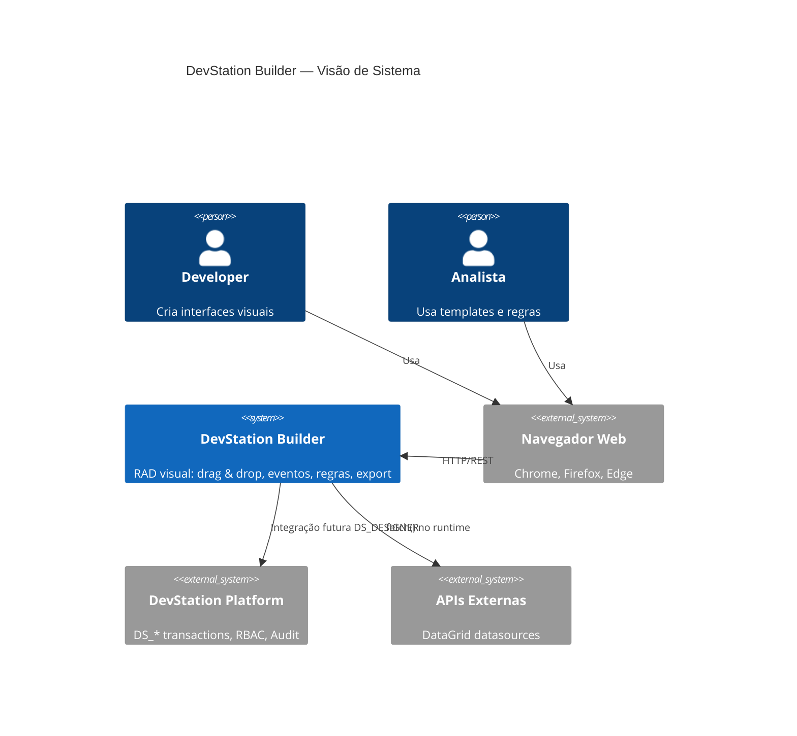

# 📘 DevStation Builder — Documentação

> **v2.2 Sprint 3** · Flask + SQLAlchemy · Bootstrap 5 · JavaScript Puro  
> Repositório: [github.com/ChristopherNicolasSMM/DEVStationFlask](https://github.com/ChristopherNicolasSMM/DEVStationFlask)

---

## 🗂️ Índice da Documentação

| # | Documento | O que contém |
|---|-----------|-------------|
| 01 | [Visão Geral](./01_visao_geral.md) | Propósito, personas, C4 Context |
| 02 | [Arquitetura](./02_arquitetura.md) | C4 Container, stack, estrutura MVC |
| 03 | [Modelos de Dados](./03_modelos_dados.md) | ER Diagram, class diagram dos models |
| 04 | [Componentes Visuais](./04_componentes_visuais.md) | Catálogo dos 36 componentes |
| 05 | [Sistema de Eventos](./05_sistema_eventos.md) | Tipos, ações, sequence diagrams |
| 06 | [Sistema de Regras](./06_sistema_regras.md) | Validação, visibilidade, cálculo |
| 07 | [API & Endpoints](./07_api_endpoints.md) | Todas as rotas HTTP |
| 08 | [Frontend Designer](./08_frontend_designer.md) | Arquitetura JS, state diagrams |
| 09 | [Fluxos de Uso](./09_fluxos_usuario.md) | Sequence diagrams dos fluxos principais |
| 10 | [Export & Preview](./10_export_preview.md) | Pipeline de geração de código |
| 11 | [Templates](./11_templates.md) | Galeria de templates prontos |
| 12 | [Guia de Desenvolvimento](./12_guia_desenvolvimento.md) | Como estender o sistema |
| 13 | [Histórico de Versões](./13_sprint_history.md) | Changelog por sprint |
| 14 | [Roadmap & Backlog](./14_roadmap.md) | Próximas sprints e backlog completo |

---

## ⚡ Quick Start

```bash
# 1. Instalar dependências
cd dsb_v2
pip install -r requirements.txt

# 2. Executar
python app.py

# 3. Acessar
http://localhost:5000
```

---

## 🏗️ Visão da Arquitetura em 30 Segundos



---

## 📊 Estado Atual do Sistema

```
36 componentes  ·  18 regras  ·  23 ações  ·  11 categorias de eventos  ·  5 templates
~2.500 linhas JS  ·  ~1.800 linhas Python  ·  28 rotas HTTP  ·  14 módulos JS
```

---

## 🔗 Navegação por Tema

### 🎨 Temas de UX/Interface
→ [Componentes Visuais](./04_componentes_visuais.md)  
→ [Frontend Designer](./08_frontend_designer.md)  
→ [Fluxos de Uso](./09_fluxos_usuario.md)  

### 🏗️ Arquitetura & Código
→ [Arquitetura](./02_arquitetura.md)  
→ [Modelos de Dados](./03_modelos_dados.md)  
→ [API & Endpoints](./07_api_endpoints.md)  

### ⚡ Lógica de Negócio
→ [Sistema de Eventos](./05_sistema_eventos.md)  
→ [Sistema de Regras](./06_sistema_regras.md)  

### 🚀 Deploy & Extensão
→ [Export & Preview](./10_export_preview.md)  
→ [Guia de Desenvolvimento](./12_guia_desenvolvimento.md)  

### 📅 Histórico & Futuro
→ [Histórico de Versões](./13_sprint_history.md)  
→ [Roadmap & Backlog](./14_roadmap.md)
